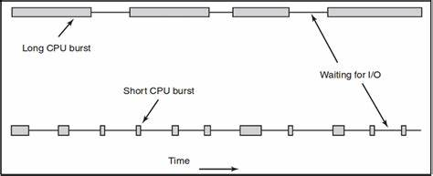
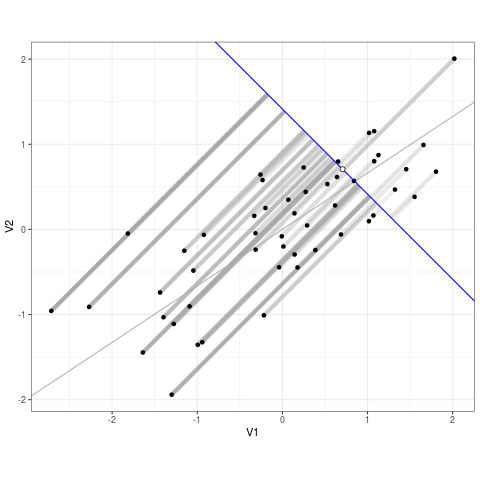
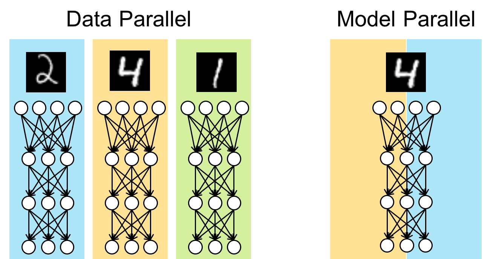
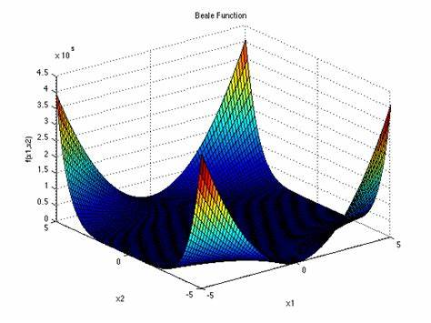
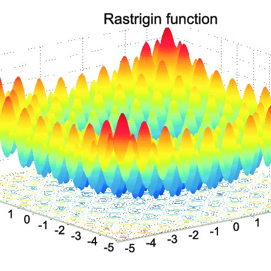
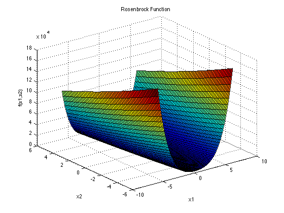

# Applying HPC
Now that you learnt what HPC is in the context of parallel & distributed computing, let's learn how you'd actually apply it to solve real-world problems.

## CPU-bound vs. IO-bound
We can roughly divide up HPC application paradigms into two based on where the performance bottleneck is. If the computer program you're trying to speed up <u>doesn't really need to work with large datasets but hogs the CPU a lot</u> then we call them CPU-bound processes. On the other hand, if <u>there's a ton of data extraction, transformation and loading with really large datasets</u> then  we call them IO-bound processes. It's useful to know this since how we write highly performant code depends on which of these categories the solution falls into.

Considerations:
- For **CPU-bound tasks**, it's important to minimize the number of threads to avoid overloading the CPU, as well as to ensure that each thread has enough CPU time to complete its work. This may involve using techniques such as task prioritization or [work stealing](https://en.wikipedia.org/wiki/Work_stealing) to balance the load between threads.
- For **IO-bound tasks**, it's important to use a large pool of threads to take advantage of the fact that these tasks spend a significant amount of time waiting for I/O operations to complete. This allows multiple IO-bound tasks to run concurrently on separate threads, maximizing the use of available I/O bandwidth and reducing the overall time taken to complete these tasks.

We will now delve into two of the most popular domains where HPC is needed - **Machine Learning & Optimisation Algorithms**. Machine learning as you might know, involves working with large amounts of data so therefore we will have to speed up IO-bound tasks. Whereas, optimisation typically involves more time on the CPU to compute a large amount of permutations of various solutions so the bottleneck here is CPU walltime instead.

> Note: In this context, we're referring to non-regression based optimisation. So think more along the lines of root finding using [heuristic algorithms](https://en.wikipedia.org/wiki/Heuristic_(computer_science)) rather than predicting the best solution based on [statistical regression](https://en.wikipedia.org/wiki/Regression_analysis) i.e. machine learning.

## Machine Learning & HPC

### What is Machine Learning?

Machine learning is a subset of artificial intelligence that involves developing AI models that enable computers to learn from and make predictions or decisions based on vast amounts of data. It pertains to training the model on these large datasets to identify patterns and insights, and automatically learn about these data to predict results from new, unseen data. The training datasets contain pre-determined outputs and their respective inputs, allowing the ML model to pick up patterns that enable these outputs to occur.

### How a ML model is trained

During the training phase of a ML algorithm, it uses the training dataset to predict the output, and then compares the predicted output to the actual output to measure the disparity and compute the loss. Next, the gradient of the loss against the model parameters is calculated and used to update the model parameters via gradient descent. This process is repeated for a specific number of times or until the loss is below a certain threshold.

Since ML algorithms often deal with massive training datasets and complex models, the training usually takes a very long time and requires significant computational resources. HPC provides a way to speed this process up by distributing the dataset or model across different nodes/GPUs. There are two main forms of parallelism - Data Parallelism and Model Parallelism.

### Data Parallelism

Data parallelism involves dividing and distributing the training dataset across multiple nodes/GPUs. Each node receives a copy of the ML model, and they individually process their portion of the data to compute the gradient. The gradients are then averaged and the weights in all the models in all the nodes are appropriately tuned. Data parallelism is more suited for instances where the training dataset is massive and the individual samples can be processed independently, such as [CNNs](https://learnopencv.com/understanding-convolutional-neural-networks-cnn/).

### Model Parallelism

Model parallelism involves partitioning the layers of the model across nodes/GPUs, allowing different parts of the model to process different batches of data simultaneously. Each node receives a layer of the ML model, and these nodes are aligned in a way that the output of one node is an input to another. These nodes individually process a different batch of data simultaneously, and then pass the data and activations to the next node. The same batch of data is passed from one node to another, with the next batch following right after. Model parallelism is more suited for models with large memory requirements or complex architectures, such as [NLPs](https://en.wikipedia.org/wiki/Natural_language_processing).

## Optimisation Algorithms

Optimisation algorithms are a family of algorithms which aim to find the best combination of some variables,
to maximise (or minimise) some kind of output.
Though that may sound quite abstract,
optimisation algorithms can in fact be applied to a variety of different practical problems.
Some examples where optimisation algorithms could be used include:

- An bakery trying to figure out which ingredients to buy to maximise profit
- A small business owner attempting to create the 'optimal' shift for their workers
- A deep learning engineer trying to find the best parameters for their artificial intelligence model

Though at surface level all these problems may look appear quite different,
each of these situations can be modelled mathematically in similar ways,
allowing us to use techniques from linear algebra to help us out.

## Linear Algebra

One can think of optimisation algorithms as an attempt to answer the question "what is the best choice one can make right now?"
In order to find the *best* choice, we should figure out some way to organise the choices we *can* make.

In virtually all cases, one can model the list of all choices as just a list of numbers, with each number corresponding to one parameter that can be adjusted, for example

- If the bakery has 10 ingredients, then the numbers could be an (ordered) list of the amount of each ingredient
- The small business owner can represent a whole shift as a list of numbers, each number corresponding the shifts of each worker
- The deep learning engineer probably has a list of parameters already, and they just need to fine tune the coefficients

This is very similar to the coordinate system taught in high school.
The same way we think of two numbers in a coordinate system as a point on the plane (like (0,0) being at the centre of the xy plane),
we can think of these lists of numbers as points on some higher dimensional plane.
See how even in the small example of the bakery with 10 ingredients, we're already dealing with 10 dimensional space.
With the small AI, one might use a model with 128 parameters.
Meaning, the mathematic represents some kind of 128-dimensional space.

If you can't imagine 128 dimensions of space, that's fine.
what's important is that the logic and systems that are true in 2 or 3 dimensions are also true in higher dimensions.
The analogy of "points in space" will also be useful in a bit.
In mathematics jargon, one could say an optimisation problem with *n* variables can be modelled as a vector space with *n+1* dimensions.
Why *n+1*? see below.

## Cost Function

Once we have a way of describing all the choices we can make, we need a way of saying how good each choice is.
In other words,
we need to take each point in our space,
and associate this with some metric of "goodness".
The better that point is, the higher number it receives.
Mathematically,
one would conceptualise this as a function which takes in the parameters as input,
and outputs something outside of those parameters.
That's where the extra *+1* variable comes from

This metric would arise naturally out of the problem we are trying to study.
For the bakery example, it would be something like how much profit each choice can generate.
In the AI example, it would probably be the performance of the model.

## Why do we need these algorithms?

Here's an exercise:

Draw a square of radius 10 and fill in with a bunch of dots in random positions.
Then, cut out 10 circles of radius 1.
Now I ask you the question,
how many dots can you cover at most?

This is a very strange question,
and its not immediately obvious how one would approach this problem.
if the points were laid out in front of us,
a human could probably intuit the best placement of circle cut outs.
But building an algorithm that can reliably cover a good amount of circles is quite difficult.

That's the point of these algorithms.
To construct a way for computers to mimic the human intuition of a strange and complicated problem.
We'll see some algorithms that can do that in a bit.
But first, some more weird functions.

## Strange Functions

Here's some images of the output of functions

These are the Beale Contour,  Rastrigin Contour, and the Rosenbrock Contour respectively.
Notice that it is not immediately obvious how a computer should determine the minima (or maxima) of these functions.
Checking every single point becomes radically exhaustive extremely quickly. So we need HPC for this.