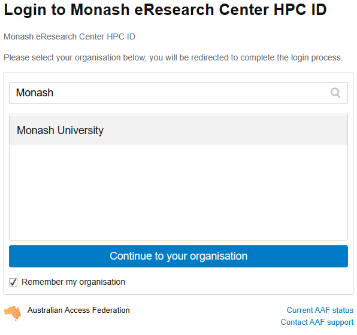
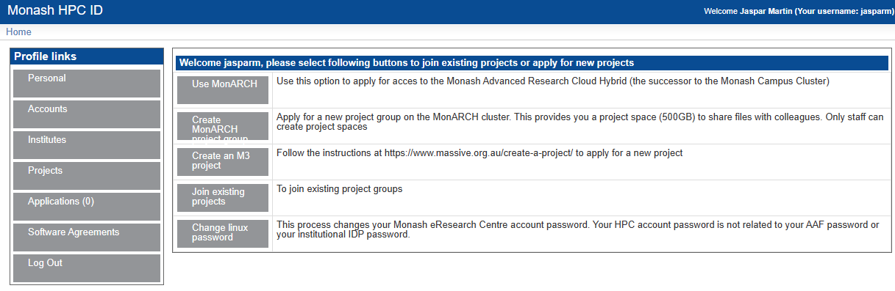
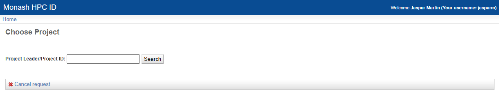

# M3 MASSIVE

MASSIVE (Multi-modal Australian ScienceS Imaging and Visualisation Environment) is a HPC supercomputing cluster that you will have access to as an MDN member. In this page we will set you up with access before you learn how to use it in Chapter 5. Feel free to go through the docs to learn about the [hardware config](https://docs.massive.org.au/M3/m3users.html) of M3 (3rd version of MASSIVE) and it's [institutional governance](https://massive.org.au/about/about.html#governance).

## Request an account

In order to access M3, you will need to request an account. To do this, follow this link: [HPC ID](https://hpc.erc.monash.edu.au/karaage/aafbootstrap). This should take you to a page this this:




Type in Monash, as you can see here. Select Monash University, and tick the Remember my organisation box down the bottom. Once you continue to your organisation, it will take you to the Monash Uni SSO login page. You will need to login with your Monash credentials.

You should now see something like this: 



Once you are here, there are a couple things you will need to do. The first, and most important is to set your HPC password. This is the password you will use to login to M3. To do this, go to home, then click on Change Linux Password. This will take you through the steps of setting your password.

Once you have done this, you can move on to requesting access to the MDN project and getting access to gurobi.

## Add to project

To request to join the MDN project, again from the Home page click on Join Exiting Project. You should see a screen like this: 



In the text box type `vf38` and click search. This is the project code for MDN. Then select the project and click submit. You will now have to wait for the project admins to approve your request. Once they have done this, you will be able to access the project. This should not take longer than a few days, and you will get an email telling you when you have access.

Once you have access to everything, you are ready to get started with M3. Good job!!

## Git SSH setup

In order to reliably clone git repos in M3, in particular private ones, it is best practice to use SSH cloning. This is a bit more complicated to set up, but once it is done, it is much more streamlined. There are few steps involved. First, you will need to generate an SSH key on M3. Login to M3, and run the following command:

```bash
ssh-keygen -t ed25519 -C "your_email@example.com"
```

This will then prompt you to enter a file location. Just press enter to use the default location. It will then ask you to enter a passphrase. This is optional, but recommended.

Once you have generated your key, you need to add it to the ssh agent. Do this by running:

```bash
eval "$(ssh-agent -s)"
ssh-add ~/.ssh/id_ed25519
```

You will then need to copy the public key to your clipboard. You can do this by running:

```bash
cat ~/.ssh/id_ed25519.pub
```

Then, go to your github account, go to settings, and click on the SSH and GPG keys tab. Click on New SSH key, and paste the key into the box. Give it a name, and click Add SSH key.

You should now be able to clone repos using SSH. To do this, go to the repo you want to clone, but instead of copying the HTTP link, copy the SSH link, and then its regular git cloning.