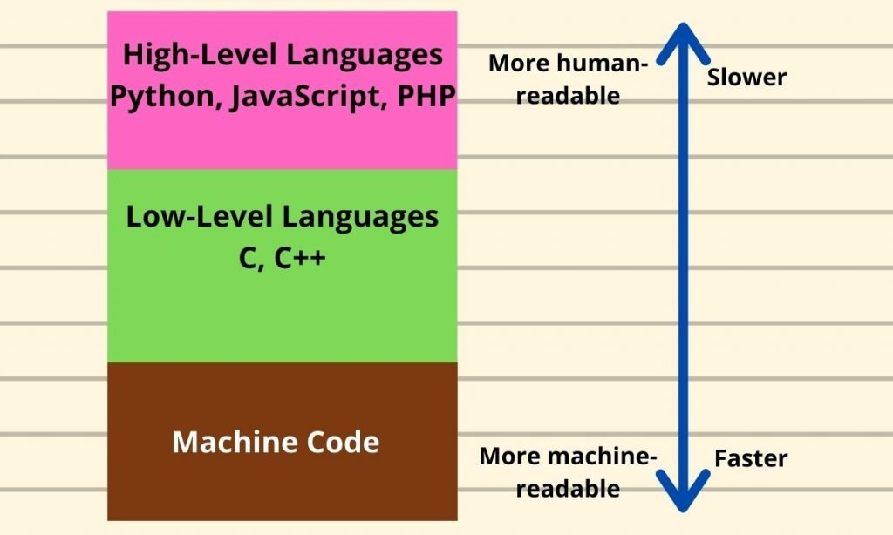

# Operating Systems

A decent chunk of HPC involves using low-level tools and techniques to find optimisations and make software run faster. The main reason we use C is that it gives us access to deeper parts of the computer that are normally hidden away and managed on your behalf by your Python or Java interpreter. 

