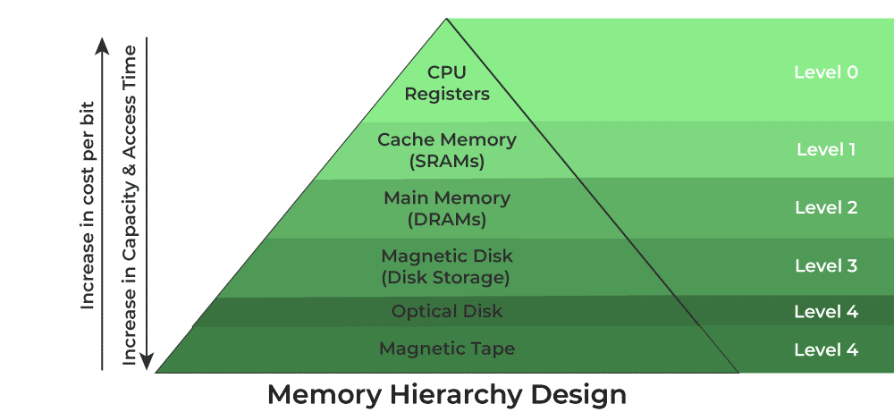

# Computer Architecture

Nearly all modern computers are based on the Von-Neumann architecture which was introduced way back in 1945. Historically there have been 2 types of Computers: 

1. **Fixed Program Computers:** Their function is very specific and they couldn’t be reprogrammed, e.g. Calculators. 
2. **Stored Program Computers:** These can be programmed to carry out many different tasks, applications are stored on them, hence the name.

Modern computers are based on a stored-program concept introduced by John Von Neumann. In this stored-program concept, both software programs (code) and data (text, images, metadata, etc...) are stored in a separate storage unit called memory and are treated the same. This novel idea meant that a computer built with this architecture would be much easier to reprogram. 

### Central Processing Unit (CPU)
Hopefully everyone here knows what a CPU is and what it generally does. We've got a brief description of it's components and a lower level view of its hardware design to give you guys some relevant insight.

1. **Control Unit:** A control unit directs all input and output flow, fetches code for instructions, and controls how data moves around the system. I think of it as the brains behind the CPU (the CPU of the CPU). 
2. **Arithmetic Logic Unit (ALU):** The ALU is the CPU component that handles all the calculations the CPU may need, e.g. Addition, Subtraction, Comparisons. It performs Logical Operations, Bit Shifting Operations, and Arithmetic operations. 

### Overview of Hardware Components
You don't need to remember everything here but as we pursue more hardware-related and low-level projects (Cluster Dev, potentially something in robotics...), these concepts are hopefully a good foundation for that.

#### Registers
Registers refer to high-speed storage areas in the CPU. They are the most expensive but also the fastest unit of memory. The data processed by the CPU are fetched from the registers. There are different types of registers used in architecture:
- **Accumulator:** Stores the results of calculations made by ALU. It holds the intermediate of arithmetic and logical operatoins.it act as  a temporary storage location or device.
- **Program Counter (PC):** Keeps track of the memory location of the next instructions to be dealt with. The PC then passes this next address to the Memory Address Register (MAR). 
- **Memory Address Register (MAR):** It stores the memory locations of instructions that need to be fetched from memory or stored in memory. 
- **Memory Data Register (MDR):** It stores instructions fetched from memory or any data that is to be transferred to, and stored in, memory. 
- **Current Instruction Register (CIR):** It stores the most recently fetched instructions while it is waiting to be coded and executed. 
- **Instruction Buffer Register (IBR):** The instruction that is not to be executed immediately is placed in the instruction buffer register IBR. 
 
#### Buses
You can think of a bus as a group of tiny wires that carry data (64 tiny wires = 64 bit bus). Data is transmitted from one part of a computer to another, connecting all major internal components to the CPU and memory, by buses. Types: 
- **Data Bus:** It carries data among the memory unit, the I/O devices, and the processor. 
- **Address Bus:** It carries the address of data (not the actual data) between memory and processor. 
- **Control Bus:** It carries control commands from the CPU (and status signals from other devices) in order to control and coordinate all the activities within the computer.

#### Input/Output Devices
Program or data is read into main memory from the input device or secondary storage under the control of CPU input instruction. Output devices are used to output information from a computer. If some results are evaluated by the computer and it is stored in the computer, then with the help of output devices, we can present them to the user.

#### Von Neumann bottleneck
Whatever we do to enhance performance, we cannot get away from the fact that instructions can only be done one at a time and can only be carried out sequentially. Both of these factors hold back the competence of the CPU. We can provide a Von Neumann processor with more cache, more RAM, or faster components but if original gains are to be made in CPU performance then a full hardware upgrade needs to happen. This is what motivates the use of parallel & distributed computing in HPC - it allows us to overcome this limitation without expensive hardware upgrades (details in later chapters).

## Memory Heirarchy

It's very important that you understand these concepts as they go to the heart of memory-based optimisations in HPC. The main purpose behind designing a memory heirarchy is to use [locality of reference](https://en.wikipedia.org/wiki/Locality_of_reference) to minimise access times as much as possible.

As you can see in the image below, there are multiple levels of memory with levels closer to the top (closer to the CPU) being smaller, more expensive but much faster than the ones to the bottom.

We can broadly divide this heirarchy into two:
1. **Primary Memory:** This comprises Main Memory, Cache Memory & CPU registers and it's directly accessible by the processor.
2. **Secondary Memory:** This is handled by external devices like Magnetic Disk, Optical Disk, and Magnetic Tape i.e. peripherals which are accessible by the processor via an I/O module and device driver.

Putting this heirarchy into perspective, we have some indicative stats below for each type of memory.

| Level | 1 |	2 |	3 |	4 |
| --- | --- | --- | --- | --- |
| Name | Register |	Cache |	Main Memory | Secondary Memory |
| Size | <1 KB | <16 MB |<16GB | >100 GB |
| Hardware |	D-latches |	SRAM |	DRAM | Magnetic |
| Access Time |	 0.25-0.5ns |	0.5-25ns |	80-250ns |	500000 ns |
| Bandwidth | 20-100 GB |	5-15 GB |	1-5 GB | 20-150 MB |
| Managed by |	Compiler |	Hardware |	Operating System | 	Operating System |