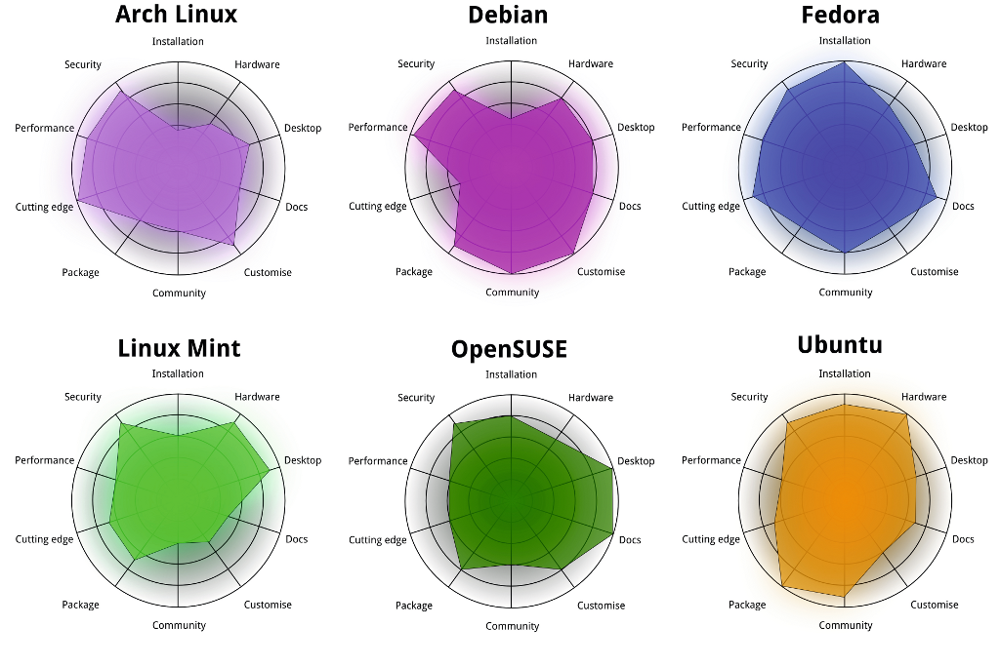
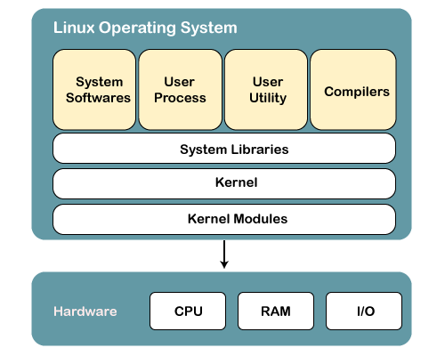
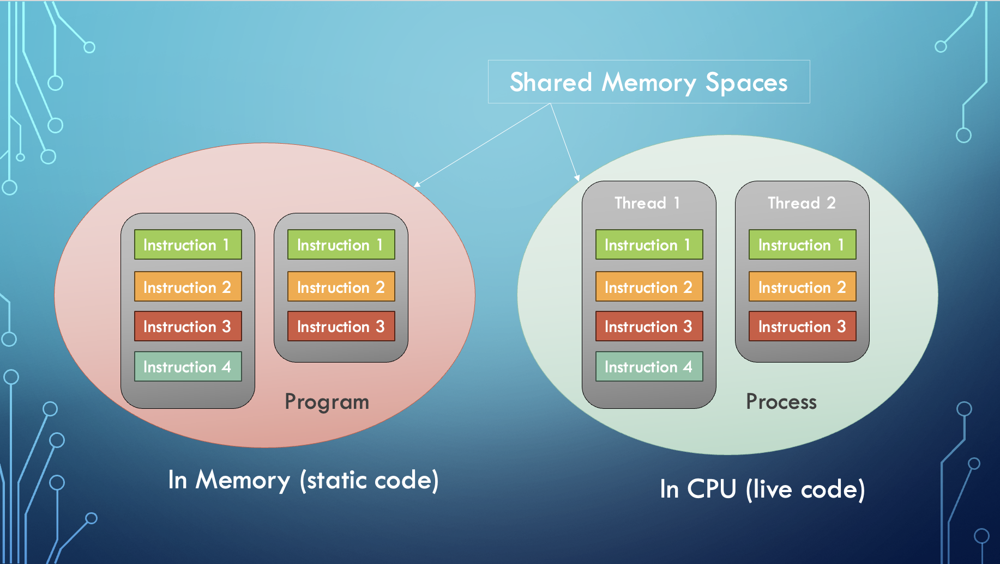
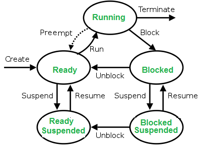

# Introduction to Linux

Linux is a freely available open-source operating system built by Linux Torvalds back in 1991. It's based off of Bell Lab's development of Unix in the 1970s which also forms the basis of Android and MacOS. It's an extremely popular operating system, especially for servers (nearly all nodes in M3 use Linux). We will be learning about it and using it to gain both low-level programming skills and an understanding of Operating Systems theory.

There are various implementations (distributions) of Linux. We won't go into detail on them but here's a comparison of some of the popular ones.

You can think of Linux as having 3 layers or components. Here they are from the highest to the lowest level (how removed they are from the hardware):
- **System Libraries:** System libraries are special functions or programs using which application programs or system utilities access the Kernel’s features. This is the topmost layer of the operating system. It allows access to the deeper parts of the machine without exposing them to direct user access. One such example for Linux and other Unix-like operating systems is `unistd.h` which provides C functions to access the POSIX (Portable Operating System Interface) API.
- **Kernel:** The kernel is the core part of Linux. It is responsible for all major activities of this operating system. It consists of various modules which are all hidden and protected from the user. The only way that a user can access the kernel is through the system library. I encourage you all to check out the [Linux kernel code on GitHub](https://github.com/torvalds/linux) (you can see Linus still actively approving all the PRs into master).
- **Device Drivers (Kernel Modules)**: If you wondered how an operating system actually controls the hardware this is how they do it. They use device drivers/kernel modules which are software programs written to act as an interface between the OS kernel and the device's firmware.

## What does an operating system actually do?
Pretty much all interactions you have with your machine is facilitated by an operating system. I find it useful to break it down into 3 functional areas.

### Compute
The operating system is what ultimately controls the CPU. Time on the CPU is a scarce resource for user applications that need to get code/instructions executed as quick as possible. Hence why compute is considered a "resource" and the OS is responsible for the fair and efficient allocation of this and all resources. 

Some more terminology - a program is a file with some non-executing (static) code while a process can be thought of as a live program that's being executed on the CPU.

Operating systems have to enable the creation of new processes, schedule them time on a CPU, manage and keep track of processes while also handling their completion. To do this there are a lot of attributes, structures and behaviours implemented by the Linux kernel.

#### Process Characteristics & Attributes
A process has the following attributes:

- Process Id: A unique identifier assigned by the operating system.
- Process State: Can be ready, running, etc.
- CPU registers: Like the Program Counter (CPU registers must be saved and restored when a process is swapped in and out of the CPU)
- Accounts information: Amount of CPU used for process execution, time limits, execution ID, etc
- I/O (input/output) status information: For example, devices allocated to the process, open files, etc
- CPU scheduling information: For example, Priority (Different processes may have different priorities, for example, a shorter process assigned high priority in the shortest job first scheduling)

A process is in one of the following states at any given time:

- New: Newly Created Process (or) being-created process.
- Ready: After the creation process moves to the Ready state, i.e. the process is ready for execution.
- Run: Currently running process in CPU (only one process at a time can be under execution in a single processor)
- Wait (or Block): When a process requests I/O access.
- Complete (or Terminated): The process completed its execution.
- Suspended Ready: When the ready queue becomes full, some processes are moved to a suspended ready state
- Suspended Block: When the waiting queue becomes full.

#### Context Switching
The process of saving the context of one process and loading the context of another process is known as Context Switching. In simple terms, it is unloading a running process into the ready state in order to load another ready process into the running state.

*When Does Context Switching Happen?*

1. When a high-priority process comes to a ready state (i.e. with higher priority than the running process). 
2. An Interrupt occurs (some I/O device tells the kernel that it needs CPU time).
3. User and kernel-mode switch.
4. Preemptive CPU scheduling is used (context switches at regular time intervals).

There is a lot more involved in how compute is managed by the OS (eg. process scheduling, threading, etc...) which will be covered in a later chapter.

### Storage
If you recall chapter 3.1, this area can be further subdivided into two - temporary storage (main memory i.e. RAM) and permenant storage (hard drives and SSDs). 

#### Linux File Systems
As you all know, computers manage the permenant storage of information using a system of files and directories. The Linux file system is a multifaceted structure comprised of three essential layers. At its foundation, the **Logical File System** serves as the interface between user applications and the file system, managing operations like opening, reading, and closing files. Below this layer, the **Virtual File System** facilitates the concurrent operation of multiple physical file systems, providing a standardized interface for compatibility. Finally, the **Physical File System** is responsible for the tangible management and storage of physical memory blocks on the disk, ensuring efficient data allocation and retrieval. Together, these layers form a cohesive architecture, orchestrating the organized and efficient handling of data in the Linux operating system.

### Networking
