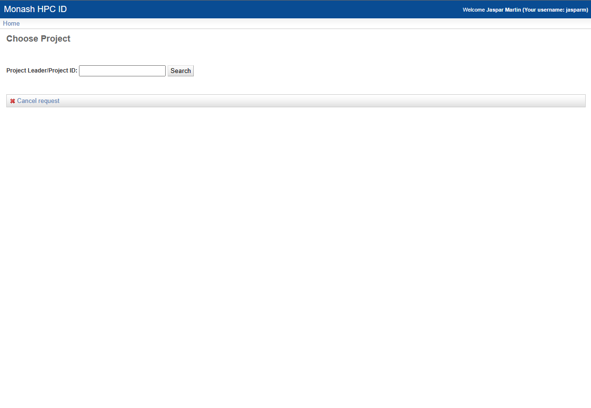
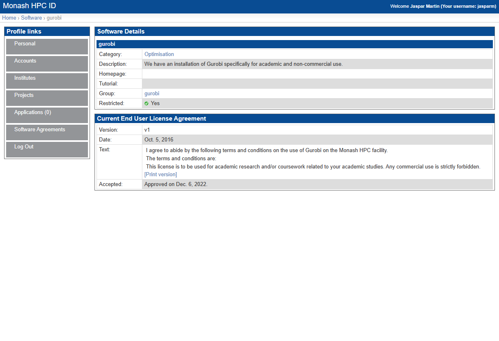
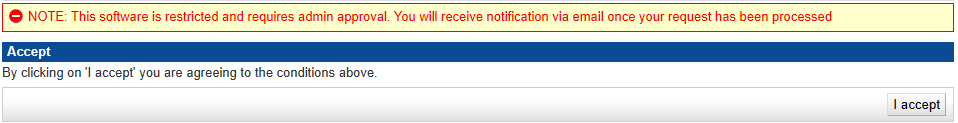

# Getting Started

## Request an account

In order to access M3, you will need to request an account. To do this, follow this link: [HPC ID](https://hpc.erc.monash.edu.au/karaage/aafbootstrap). This should take you to a page this this:  

Type in Monash, as you can see here. Select Monash University, and tick the Remember my organisation box down the bottom. Once you continue to your organisation, it will take you to the Monash Uni SSO login page. You will need to login with your Monash credentials.

You should now see something like this: 

Once you are here, there are a couple things you will need to do. The first, and most important is to set your HPC password. This is the password you will use to login to M3. To do this, go to home, then click on Change Linux Password. This will take you through the steps of setting your password.

Once you have done this, you can move on to requesting access to the MDN project and getting access to gurobi.

## Add to project

To request to join the MDN project, again from the Home page click on Join Exiting Project. You should see a screen like this: 

In the text box type `vf38` and click search. This is the project code for MDN. Then select the project and click submit. You will now have to wait for the project admins to approve your request. Once they have done this, you will be able to access the project. This should not take longer than a few days, and you will get an email telling you when you have access.

## Access gurobi

As part of the work that we do, you will need access to [Gurobi](https://www.gurobi.com). M3 has an agreement with Gurobi, however you need to specifically request access to use it.

To do this, in HPC ID, click on Software Agreements on the left. Then Add Software. This will bring up a list of all available software on M3. Scroll down until you find gurobi, and click on it. This will bring up a page like this: 

Except instead of saying accepted at the bottom it will ask you to tick a box saying that you agree to TOS 

Click I accept, and follow the steps. It should tell you that you will have to wait for approval to access gurobi. This should not take longer than a few days, and you will get an email telling you when you have access.

Once you have access to everything, you are ready to get started with M3. Good job!!
