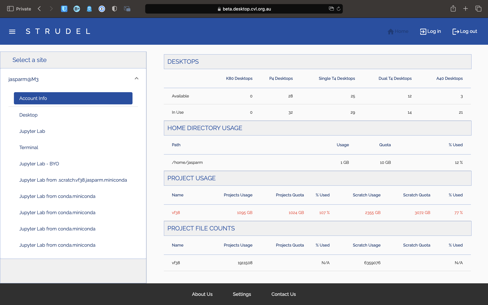

# Strudel

STRUDEL is a web application used to connect to M3. There are two main benefits to this over regular ssh. Firstly, you are able to access a desktop session, so you can interact easier with M3, look at graphs, etc.. STRUDEL also enables the use of Jupyter notebooks, which are especially useful for data science and machine learning.

## Accessing STRUDEL

First, go to the [STRUDEL](https://beta.desktop.cvl.org.au/) website. You should see something like this:

Select the CVL option, and you should be taken to another page, where you choose how to log in.

Select AAF. On the next page, search for and select Monash University.

You will now be taken to the Monash login page. Once you have logged in, it will show one last page, asking permission to use your details. Click allow, and you will be taken to the STRUDEL home page.

## Desktop Session

To start a desktop session using STRUDEL, click on the **Desktop** tab on the side, select your desired options, and click launch. Once the session has started, you will be able to attach to it by clicking on the connect button in the *Pending / Running Desktops* section.

## Jupyter Notebooks

Similar to Desktops, if you want a basic Jupyter notebook, click on the **Jupyter Lab** tab, choose how much compute you want, and click launch.

If you want to have a more customised Jupyter notebook, you can do this by first sshing into M3, and activate conda. Then activate the conda environment `jupyterlab`. Install you desired packages in this environment. Once you have done this, go back to STRUDEL, and launch a **Jupyter Lab - BYO** session.