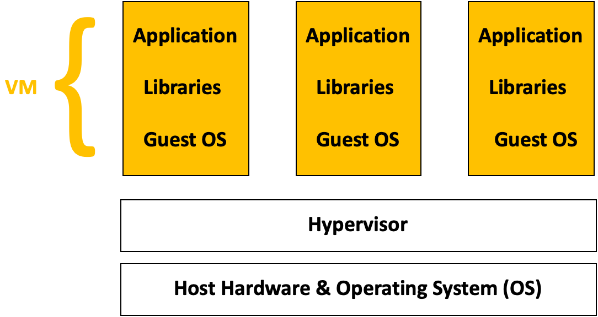

# VMs & Containers

## What is a virtual machine (VM)?

A virtual machine is not a physical machine. It’s a file that replicates the computing environment of a physical machine. It’s similar to how virtual reality (VR) environments replicate the real world. VR isn’t a physical space; it’s a virtual imitation. Still, we can perform real-world functions in VR, such as exploring and interacting with objects. Instead of imitating video game functions, virtual machine software emulates computer system functions i.e. the operating system. To achieve this VMs use a technology called **virtualisation** as shown below.

At the base, you have the host hardware and OS. This is the physical machine that is used to create the virtual machines. On top of this, you have the hypervisor. This allows multiple virtual machines, each with their own operating systems (OS), to run on a single physical server.

VMs have a few downsides, though, which containers address. Two downsides particularly stand out:

- **VMs consume more resources:** VMs have a higher resource overhead due to the need to run a full OS instance for each VM. This can lead to larger memory and storage consumption. This in turn can have a negative effect on performance and startup times of the virtual machine.
- **Portability:** VMs are typically less portable due to differences in underlying OS environments. Moving VMs between different hypervisors or cloud providers can be more complex.

## What is a container?

A container is a lightweight, standalone, and executable software package that includes everything needed to run a piece of software, including the code, runtime, system tools, and libraries.

Containers are designed to isolate applications and their dependencies, ensuring that they can run consistently across different environments. Whether the application is running from your computer or in the cloud, the application behaviour remains the same.

Unlike VMs which virtualise the hardware, containers *virtualise the operating system*. This simply means that a container uses a single OS to create a virtual application and its libraries. Containers run on top of a shared OS provided by the host system.

The container engine allows you to spin up containers. It provides the tools and services necessary for building, running, and deploying containerised applications.

## Docker
As you might know, Docker is an open-source containerization platform by which you can pack your application and all its dependencies into a standardized unit called a container. Let's clarify some Docker terminology,

- **Docker Image**: An image is an inert, immutable, file that's essentially a snapshot of a container. Images are created with the [build](https://docs.docker.com/reference/cli/docker/image/build/) command, and they'll produce a container when started with [run](https://docs.docker.com/reference/cli/docker/container/run/). Images are stored in a Docker registry such as [registry.hub.docker.com](https://registry.hub.docker.com).
- **Docker Container**: To use a programming metaphor, if an image is a class, then a container is an instance of a class—a runtime object. Multiple containers can run from the same image simultaneously.
- **Docker Daemon**: The Docker daemon (`dockerd`) listens for Docker API requests and manages Docker objects such as images, containers, networks, and volumes.
- **Docker Client**: The Docker client (`docker`) is the primary way that many Docker users interact with Docker. When you use commands such as `docker run`, the client sends these commands to `dockerd`, which carries them out.
- **Docker Desktop**: This is an easy-to-install application for your Mac, Windows or Linux environment that enables you to build and share containerized applications and microservices.

### Docker Architecture
Docker uses a client-server architecture. The Docker client talks to the Docker daemon, which does the heavy lifting of building, running, and distributing your Docker containers.

Go through [this guide](https://www.docker.com/get-started/) to download and install Docker. If you'd like to learn more about it's functionality and how to work with it, [check out their documentation website](https://docs.docker.com/get-started/overview/).