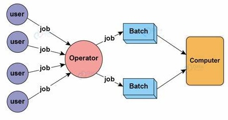
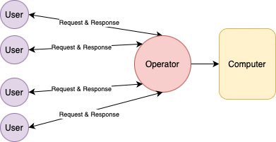

# Batch Processing vs. Cloud Computing

You are all likely familiar with the definition of High Performance Computing. Here is one from IBM,

> High-performance computing (HPC) is technology that uses clusters of powerful processors that work in parallel to process massive multi-dimensional data sets, also known as big data, and solve complex problems at extremely high speeds. HPC solves some of today’s most complex computing problems in real time.

But the term HPC is not really used much outside the scientific research community. A lot of cloud systems involve similar scale of hardware, parallel & distributed computing, similar computational workload, data processing capacity and low latency/high throughput capability as HPC clusters. *So what exactly is the difference between a cloud system and a HPC cluster?* 

At the end of the day this comes down to semantics but a key difference is that a HPC cluster implies a system primarily used for **batch processing** whereas a cloud system would involve **interactive processing**.

## Key Differences

The vast majority of computer systems and nearly 100% of the ones that the average person uses is a cloud-based interactive system. Due to the nature of use cases specific to researchers, batch processing is a much more suitable choice for them.

__Batch Processing:__
- Jobs (code scripts) submitted are executed at a later time.
- User can't interact (or only limited interaction).
- Performance measure is **throughput**.
- Snapshot of output is used for debugging.

__Interactive Processing:__
- Jobs submitted are executed immediately.
- User can interact.
- Performance measure is **response time**.
- Interactive debugging.

