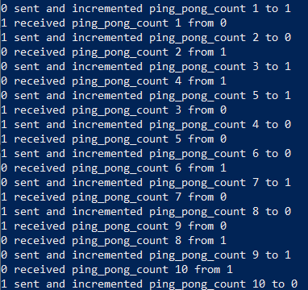

# Challenges

## Install MPI for the tasks

- ```~/vf38/HPC_Training/spack/share/spack/setup-env.sh``` #configure spack
- ```spack load mpich```  #load MPICH through spack
- ```module load gcc```  #load gcc
- ```cp -r ~/vf38/HPC_Training/MPI_examples ~```   #copy tasks to your home directory

## Task 1: Hello World

1. Go to folder ‘hello’
2. Modify the files
3. Compile mpi_hello_world.c using makefile
4. Execute the file

## Task 2: Ping Pong

1. Go to ‘ping_pong’ folder
2. Modify the files
3. Compile the files
4. Run (world size must be two for this file)

Output should be similar to this. May be slightly different due to process scheduling



## Task 3: Monte Carlo

- Run “./calcPiSeq 100000000” # make sure you use gcc for compiling serial code
- Modify calcPiMPI.c
- Run calcPiMPI 100000000 with mpi and see the difference. You can change the number of processes. However, please be mindful that you are in login node!
Hint: # <https://www.mpich.org/static/docs/v3.3/www3/MPI_Reduce.html>

## Task 4: Parallel computing task on compute nodes

- Submit your parallelised Monte Carlo task on compute nodes with 8 tasks

## Task 5: Trapezoidal Rule Integration

- Run “./seq_trap 10000000000”
- Modify calcPiMPI.c
- Run seq_MPI 100000000000 with mpi and see the difference. You can change the number of processes. However, please be mindful that you are in login node!

## Task 6: Bonus: Merge Sort

- This task is quite challenging to parallelise it yourself
- Please refer to the answer and check if you can understand it <https://selkie-macalester.org/csinparallel/modules/MPIProgramming/build/html/mergeSort/mergeSort.html>

Additional resources: <https://selkie-macalester.org/csinparallel/modules/MPIProgramming/build/html/index.html>
