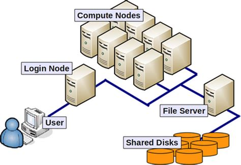
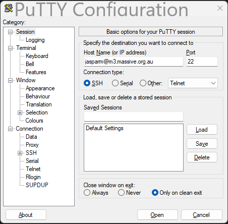
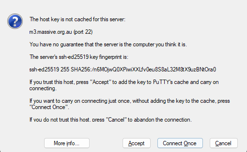
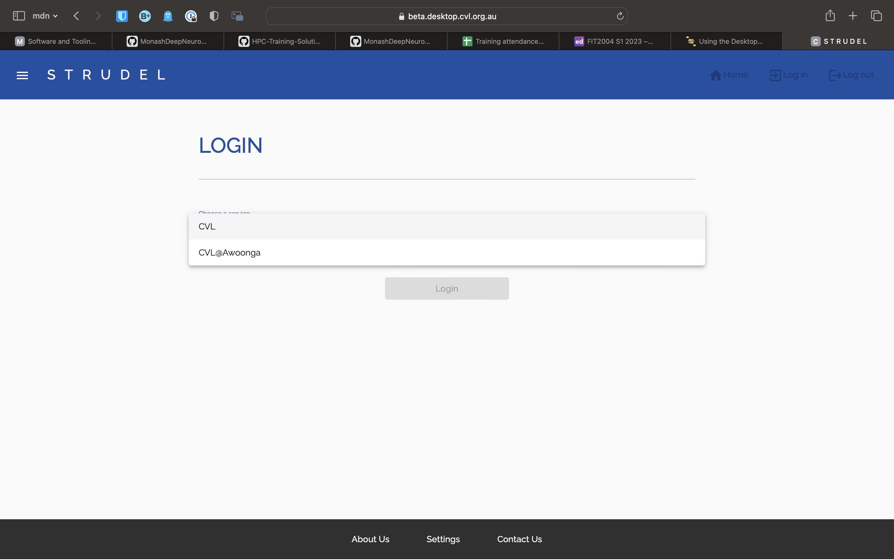
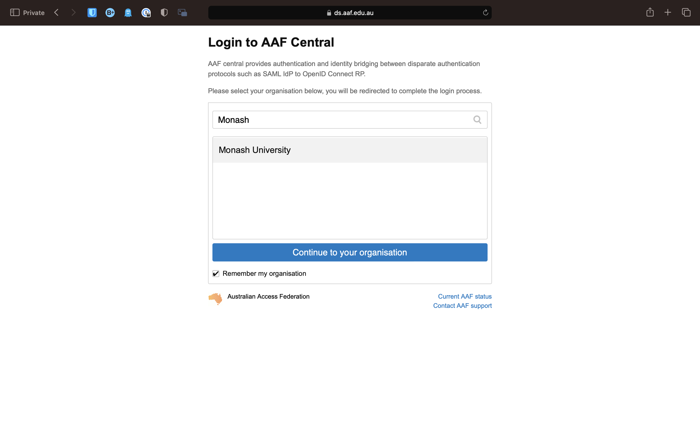
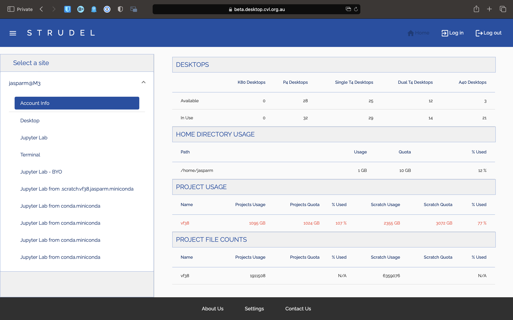

# Accessing M3 MASSIVE

The M3 MASSIVE supercomputer has a particular kind of distributed computing architecture called the [master-slave architecture](https://en.wikipedia.org/wiki/Master–slave_(technology)). The master (aka driver) node in SLURM & M3 is referred to as the **login node** while the slave nodes are the **compute nodes**.



To access the M3 cluster's login node you have two options,
- Use the SSH protocol in a terminal session.
- Use Strudel (webapp built on top of SSH) to create a desktop session.

## Login via SSH

### Windows

If you are using windows, the best way to ssh into m3 is by using [puTTY](https://www.chiark.greenend.org.uk/~sgtatham/putty/latest.html).

Once installed and opened, you will see a page like this:



Type in your m3 username followed by `@m3.massive.org.au` and press enter or the Open button.

If it the first time accessing M3 from this client then you may see something like this:



Just click Accept, and puTTY will add the cluster's ssh fingerprint to cache.

### Mac / Linux

On macOS or linux, ssh is built into the terminal, so just copy the following into your shell, substituting username for your username.

```bash
ssh username@m3.massive.org.au
```

You may get a similar warning to the above image about the server identity, just type `yes` or `Y` to accept it and add the ssh key to cache.

> **Note**:
> It is possible to use VSCode's built in terminal to ssh into M3, but it is not recommended. It puts unnecessary strain on the login nodes. M3 have a [guide](https://docs.massive.org.au/M3/connecting/strudel2/connecting-to-vscode.html) on how to correctly connect to M3 using VSCode, however it is quite involved and not particularly necessary unless you want to do proper development on M3 and want to use VSCode to program in.

Everything from now on will be the same across whatever computer you are using to access the cluster.

The first thing to pop up will be a request for a password. Don't worry when you don't see your cursor moving when typing, this is just for security. Your password is still being recorded.

Once you have logged in, you will come to a page that looks like this:

```txt
+----------------------------------------------------------------------------+
|                            Welcome to MASSIVE M3                           |
|                                                                            |
|    For assistance please contact help@massive.org.au or (03) 9902 4845     |
|     The MASSIVE User Guide          https://docs.massive.org.au            |
+----------------------------------------------------------------------------+

  - Useful Slurm Commands:
     squeue
     sbatch <slurm_script_file>
     scontrol show job <JOBID>
     scancel <JOBID>

  - Massive User Scripts:
     show_job
     show_job <JOBID>
     show_cluster
     user_info

  - Slurm Sample Scripts are Here:
     /usr/local/hpcusr/latest/training/samples/slurm/

  - We recommend using smux to compile and test code on compute nodes.
  - How to use smux: https://docs.massive.org.au/M3/slurm/interactive-jobs.html

 For more details, please see:
    https://docs.massive.org.au/M3/slurm/slurm-overview.html
------------------------------------------------------------------------------

Use MASSIVE Helpdesk to request assistance with MASSIVE related computing
questions and problems. Email to help@massive.org.au and this will generate
a ticket for your issue.

------------------------------------------------------------------------------


[jasparm@m3-login2 ~]$
```

Once you are done and want to logout, just type `exit`. This will close the connection.

## Login via Strudel

STRUDEL is a web application used to connect to M3. There are two main benefits to this over regular ssh. Firstly, you are able to access a desktop session, so you can interact easier with M3, look at graphs, etc.. STRUDEL also enables the use of Jupyter notebooks, which are especially useful for data science and machine learning.

### Accessing STRUDEL

First, go to the [STRUDEL](https://beta.desktop.cvl.org.au/) website. You should see something like this:



Select the CVL option, and you should be taken to another page, where you choose how to log in.


Select AAF. On the next page, search for and select Monash University.



You will now be taken to the Monash login page. Once you have logged in, it will show one last page, asking permission to use your details. Click allow, and you will be taken to the STRUDEL home page.



### Desktop Session

To start a desktop session using STRUDEL, click on the **Desktop** tab on the side, select your desired options, and click launch. Once the session has started, you will be able to attach to it by clicking on the connect button in the *Pending / Running Desktops* section.

### Jupyter Notebooks

Similar to Desktops, if you want a basic Jupyter notebook, click on the **Jupyter Lab** tab, choose how much compute you want, and click launch.

If you want to have a more customised Jupyter notebook, you can do this by first sshing into M3, and activate conda. Then activate the conda environment `jupyterlab`. Install you desired packages in this environment. Once you have done this, go back to STRUDEL, and launch a **Jupyter Lab - BYO** session.