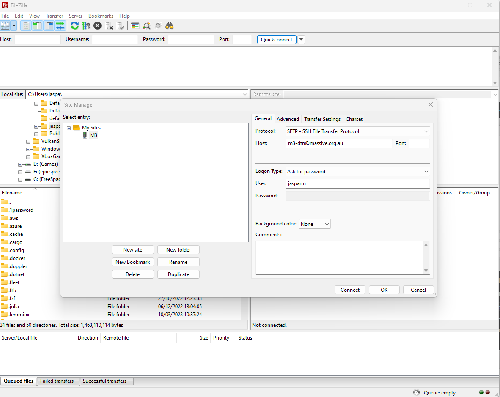

# M3 Interface & Usage

### Cluster Specific Commands

| Command | Function | Flags
| --- | --- | --- |
| `show_job` | prints information about your jobs |
| `show_cluster` | prints information about the cluster |
| `user_info` | prints information about your account |
| `squeue` | prints information about your jobs | `-u <username>` to print information about a specific user |
| `sbatch <slurm_script_file>` | submit a job to the cluster |
| `scontrol show job <JOBID>` | prints information about a specific job |
| `scancel <JOBID>` | cancel a job |

## M3 Specific Commands

| Command | Function |
| --- | --- |
| `module load <module_name>` | load a module |
| `module unload <module_name>` | unload a module |
| `module avail` | list available modules |
| `module list` | list loaded modules |
| `module spider <module_name>` | search for a module |
| `module help <module_name>` | get help for a module |
| `module show <module_name>` | show details about a module |
| `module purge` | unload all modules |
| `module swap <module_name> <module_name>` | swap two modules |

## M3's Shared Filesystem

When we talk about a shared filesystem, what we mean is that the filesystem that M3 uses allows multiple users or systems to access, manage, and share files and directories over a network, concurrently. It enables users to collaborate on projects, share resources, and maintain a unified file structure across different machines and platforms. In addition to this, it enables the many different compute nodes in M3 to access data from a single source which users also have access to, simplifying the process of running jobs on M3.

Very simply, the way it works is that the home, project and scratch directories are mounted on every node in the cluster, so they are accessible from any node.

M3 has a unique filesystem consisting of three main important parts (for you).

### Home Directory

There is each user's personal directory, which only they have access to. This has a ~10GB allocation, and should store any hidden files, configuration files, or other files that you don't want to share with others. This is backed up nightly.

### Project Directory

This is the shared project directory, for all users in MDN to use. This has a ~1TB allocation, and should be used only for project specific files, scripts, and data. This is also backed up nightly, so in the case that you accidentally delete something important, it can be recovered.

### Scratch Directory

This is also shared with all users in MDN, and has more allocation (~3TB). You may use this for personal projects, but keep your usage low. In general it is used for temporary files, larger datasets, and should be used for any files that you don't need to keep for a long time. This is not backed up, so if you delete something, it's gone forever.

### General Rules

- Keep data usage to a minimum. If you have a large amount of data, consider moving it to the scratch directory. If it is not necessary to keep it, consider deleting it.
- Keep your home directory clean.
- In general, it is good practice to make a directory in the shared directory for yourself. Name this your username or name, to make it easily identifiable. This is where you should store your files for small projects or personal use.
- The project directory is not for personal use. Do not store files in the project directory that are not related to MDN. Use the scratch directory instead.

### Copying files to and from M3

Copying files to and from M3 can be done in a few different ways. We will go over the basics of scp, as well as setting up FileZilla. 

A key thing to remember when copying files to and from M3 is that you shouldn't be using the regular ssh url. Instead, they have a dedicated SFTP url to use for file transfers. This is `m3-dtn.massive.org.au`. This is the url you will use when setting up FileZilla, and when using scp.

#### Using scp

You can copy files to M3 using the `scp` command. This is a command line tool that is built into most linux distributions. If you are using Windows, you will need to install a tool like [Git Bash](https://gitforwindows.org/) to use this command.

##### Linux / Mac

To copy a file to M3, use the following command:

```bash
scp <file> <username>@m3-dtn.massive.org.au:<destination>
```

For example, if I wanted to copy a file called `test.txt` to my home directory on M3, I would use the following command:

```bash
scp test.txt jasparm@m3-dtn.massive.org.au:~
```

To copy a file from M3 to your local machine, use the following command:

```bash
scp <username>@m3-dtn.massive.org.au:<file> <destination>
```

So, to bring that same file back to my local machine, I would use the following command:

```bash
scp jasparm@m3-dtn.massive.org.au:~/test.txt .
```

#### FileZilla

FileZilla is a SFTP client that the M3 staff recommend using. You can download it [here](https://filezilla-project.org/download.php?show_all=1).

Once installed, run the program and click on File -> Site Manager or `Ctrl-S`. This will open the site manager. Click on New Site, and enter the following details:

- Protocol: SFTP
- Host: `m3-dtn.massive.org.au`
- Logon Type: Ask for password
- User: `<your username>`

Don't change anything else. Leave password blank for now.

It should look something like this:

Click on Connect, and enter your password when prompted. You should now be connected to M3. You can now drag and drop files to and from M3.

## Software and Tooling

Software and development tooling is handled a little differently on M3 than you might be used to. In particular, because M3 is a shared file system, you do not have access to `sudo`, and you cannot install software on the system manually. Instead, you will need to use the `module` command to load software and development tools.

### Module

The `module` command is used kind of as an alternative to package managers like `apt` or `yum`, except it is managed by the M3 team. It allows you to load software and development tools into your environment, and is used to load software on M3. To see a comprehensive list of commands go [here](./linux-cmds.md#m3-specific-commands).

In general, however, you will only really need to use `module load` and `module unload`. These commands are used to load and unload software and development tools into your environment.

For most of the more popular software packages, like gcc, there are multiple different versions available. You will need to specify which version you want to load based on your needs.

## C

### GCC

To load GCC, you can run the following command:

```bash
module load gcc/10.2.0
```

This will load GCC 10.2.0 into your environment, and you can use it to compile C/C++ programs as described in the [Intro to C](../chapter2/intro-to-c.md) chapter. To unload GCC, you can run the following command:

```bash
module unload gcc/10.2.0
```

## Python

Python is a bit of a special case on M3. This is because of how many different versions there are, as well as how many different packages are available. To make things easier, it is recommended that you use miniconda or anaconda to manage your python environments instead of using the system python.

These instructions are based off the M3 docs, which can be found [here](https://docs.massive.org.au/M3/software/pythonandconda/pythonandconda.html#pythonandconda).

### Miniconda

#### Installing Miniconda

To install Miniconda on M3, there is a dedicated install script that you can use. This will install miniconda into your default scratch space, i.e. `/vf38_scratch/<username>/miniconda3`. To install miniconda, run the following command:

```bash
module load conda-install

# To install miniconda to the default location 
conda-install

# To install miniconda to a custom location
conda-install your/install/location
```

#### Activating Miniconda

To activate the base conda environment, run the following command:

```bash
source your/install/location/miniconda/bin/activate
```

You will notice that once activated, `(base)` will appear in the prompt before your username.

To create and activate Python environments within Miniconda, follow these steps:

```bash
# Create a new environment
# Change env-name to whatever you want to call your environment
conda create --name env-name python=<version>

# Activate the environment
conda activate env-name
```

#### Managing Python packages

Use the following commands to install and manage Python packages:

```bash
# Install a package
conda install package-name

# Update a package
conda update package-name

# You can also change the version of packages by adding a = and the version number

# Remove a package
conda remove package-name
```

#### Deactivating Miniconda

To deactivate the conda environment you are in, run `conda deactivate`. To exit conda entirely run `conda deactivate` again. You will know you have fully exited conda when `(base)` is no longer in the prompt.

### VIM

VIM is a terminal based text editor. You may have heard about it, or even tried using it before. If so, you might recognise the common meme of "how do I exit VIM???". This is because VIM uses a very different key binding system to other text editors, and it can be a little confusing to get used to. However, once you get used to it, it is actually a very powerful and efficient text editor.

I will attemt to give a brief overview of VIM commands, however you should really check out the [VIM documentation](https://vimhelp.org/) if you want to learn more.

VIM also has a built in tutorial that you can access by running `:help` while in VIM.

To use VIM to edit a file, just type `vim <filename>` into the terminal. This will open the file in VIM. If the file does not exist, it will create a new file with that name.

VIM has three different modes. The first is the command mode, which is the default mode when you open a file. In this mode, you can navigate around the file, and perform other commands. The second is the insert mode, which is used to insert text into the file. The third is the visual mode, which is used to select text.

To enter the insert mode, press `i`. To exit the insert mode, press `esc`. To enter the visual mode, press `v`. To exit the visual mode, press `esc`.

In command mode, you move around using `h`, `j`, `k`, `l`. To move along words, press `w` or `b`. To move to the start or end of the line, press `0` or `$`. You can delete a line using `dd`, or delete a word using `dw`. You might be noticing some patterns here. In VIM, commands are made up of single or multiple characters that represent different things. For example, if I wanted to delete a word, I would press `d` to delete, and then `w` to delete a word. If I wanted to delete 3 words, I would press `d3w`. If I just wanted to change a word, I would press `c` instead of `d`. If I wanted to change 3 words, I would press `c3w`. If I wanted to change a line, I would press `cc`. Some other useful command mode commands are `u` to undo, `o` to insert a new line and go into insert mode, and `?` to search for a string.

To get to insert mode, there are a lots of different ways, but the most common are `i` to insert text before the cursor, `a` to insert text after the cursor, and `o` to insert a new line. The capital versions of these also do things. `I` inserts text at the start of the line, `A` inserts text at the end of the line, and `O` inserts a new line above the current line. To exit insert mode, press `esc`.

To get to visual mode, press `v`. In visual mode, you can select text using the same commands as in command mode. To delete the selected text, press `d`. To change the selected text, press `c`. To copy the selected text, press `y`. To paste press `p`. To exit visual mode, press `esc`.

To exit VIM itself, enter command mode, and then press `:q!`. This will exit VIM without saving any changes. To save and exit, press `:wq`. To save without exiting, press `:w`.
