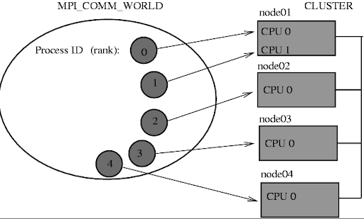
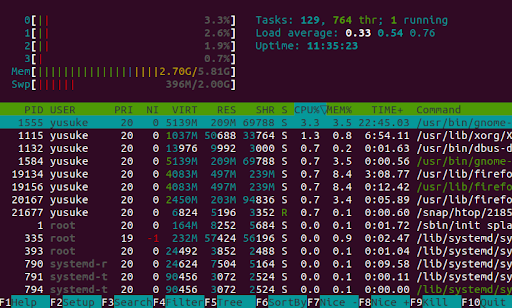
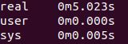

# OpenMPI

## Primary MPI Routines

``` C
int MPI_Init(int * argc, char ** argv);
// initializes the MPI environment.
// Argc argv are the parameters come
// from main(argc,argv). The return value is an
// error code. 0 is OK. Non-zero is an error code
```

``` C
int MPI_Comm_size(MPI_Comm comm, int \* size);
// this functions gets the number of MPI processes
// i.e. the number you enter when you go mpirun -np \<size> myprog.exe
// *size is C syntax indicating that size will be modified to contain
// the value after the function returns. The return value is only used
// for error detection. printf(“MPI size is %d\n”,size);
int MPI_Comm_rank(MPI_Comm comm, int \* rank);
// this returns the rank of this particular process
// rank contains the value for that process- the function return value is an error code
```



### Point-to-Point communication

These are blocking functions - they wait until the message is sent or received. Note that the CPU is actively polling the network interface when waiting for a message. This is opposite in behaviour to other C functions, i.e. c= getChar() (which causes a context switch and then a sleep in the OS). This is done for speed reasons.

```C
int MPI_Send(void * buf, int count, MPI_Datatype type, int dest, int tag, MPI_Comm comm);
```

Sends a message from the calling process to another process

INPUT PARAMETERS

- ```buf```
  - Initial address of send buffer (choice).
- ```count```
  - Number of elements sent (non negative integer).
- ```type```
  - DataType of each send buffer element (handle).
- ```dest```
  - Rank of destination (integer).
- ```tag```
  - Message tag (integer).
- ```comm```
  - Communicator (handle).

OUTPUT PARAMETER

- ```IERROR```
  - Fortran only: Error status (integer).

```c
int MPI_Recv(void * buf, int count, MPI_Datatype type, int source, int tag, MPI_Comm comm, MPI_Status * status);
```

Receives a message from another process

INPUT PARAMETERS

- ```count```
  - Maximum number of elements to receive (integer).
- ```type```
  - DataType of each receive buffer entry (handle).
- ```source```
  - Rank of source (integer).
- ```tag```
  - Message tag (integer).
- ```comm```
  - Communicator (handle).

OUTPUT PARAMETERS

- ```buf```
  - Initial address of receive buffer (choice).
- ```status```
  - Status object (status).
- ```IERROR```
  - Fortran only: Error status (integer).

### Primary MPI Routines closing

In a header file you will find

``` C
int MPI_Finalize(void);
```

To call in your C or C++ program

``` C
#include <mpi.h>
MPI_Finalize();
```

## General overview MPI program

``` C
...
int MPI_Init(int  argc, char ** argv);
--------------------------Parallel algorithm starts----------------------
int MPI_Comm_size(MPI_Comm comm, int * size);
int MPI_Comm_rank(MPI_Comm comm, int * rank);
...
int MPI_Send(void * buf, int count, MPI_Datatype type, int dest, int tag, MPI_Comm comm);
int MPI_Recv(void * buf, int count, MPI_Datatype type, int source, int tag, MPI_Comm comm, MPI_Status * status);
…
--------------------------Parallel algorithm ends-----------------------
int MPI_Finalize(void);
...

```

Use man pages to find out more about each routine

When sending a Process it packs up all of its necessary data into a buffer for the receiving process. These buffers are often referred to as envelopes since the data is being packed into a single message before transmission (similar to how letters are packed into envelopes before transmission to the post office)

## Elementary MPI Data types

MPI_Send and MPI_Recv utilize MPI Datatypes as a means to specify the structure of a message at a higher level. The data types defined in the table below are simple in nature and for custom data structures you will have to define the structure.

| MPI datatype            | C equivalent           |
|-------------------------|------------------------|
| MPI_SHORT               | short int              |
| MPI_INT                 | int                    |
| MPI_LONG                | long int               |
| MPI_LONG_LONG           | long long int          |
| MPI_UNSIGNED_CHAR       | unsigned char          |
| MPI_UNSIGNED_SHORT      | unsigned short int     |
| MPI_UNSIGNED            | unsigned int           |
| MPI_UNSIGNED_LONG       | unsigned long int      |
| MPI_UNSIGNED_LONG_LONG  | unsigned long long int |
| MPI_FLOAT               | float                  |
| MPI_DOUBLE              | double                 |
| MPI_LONG_DOUBLE         | long double            |
| MPI_BYTE                | char                   |

## Example of a simple program

``` C

/*
 MPI Program, send ranks
*/

#include <stdio.h>
#include <mpi.h>

#define MASTER 0

int main(int argc, char *argv[])
{

   int my_rank;
   /* Also known as world size */
   int num_processes;

   /* Initialize the infrastructure necessary for communication */
   MPI_Init(&argc, &argv);

   /* Identify this process */
   MPI_Comm_rank(MPI_COMM_WORLD, &my_rank);

   /* Find out how many total processes are active */
   MPI_Comm_size(MPI_COMM_WORLD, &num_processes);

   printf("Process %d: There is a total of %d \n", my_rank, num_processes);

   if (my_rank == MASTER)
   {
       int dest = 1;
       int tag = 0;
       int count = 1;

       MPI_Send(&my_rank, count, MPI_INT, dest, tag, MPI_COMM_WORLD);

       printf("Process %d: Sent my_rank to process %d \n", my_rank, dest);
   }
   else
   {
       int tag = 0;
       int count = 1;
       int buffer;
       MPI_Recv(&buffer, count, MPI_INT, MASTER, tag, MPI_COMM_WORLD, MPI_STATUS_IGNORE);
       printf("Process %d: Received %d from process %d \n", my_rank, buffer, MASTER);
   }

   /* Tear down the communication infrastructure */
   MPI_Finalize();
   return 0;
}
```

## Compilation and Linking

- Make sure you have the following packages installed and that they are in your $PATH:
  - gcc
  - OPENMPI or MPICH
- To compile and Link:
  - ```mpicc -Wall -o <program-name.exe> <program-name.c>```
  - -Wall This enables all the warnings about questionable code.
  - -o sets the output executable name. If you omit it, it defaults to a.out
- To run:
  - ```mpirun -np <Number-of-processes> <program-name.exe>```
- Behind the scenes:
  - mpicc is just a wrapper around a C compiler. To see what it does type:
    - ```mpicc –showme```

### sbatch to send job to compute nodes using SLURM

``` bash
#!/bin/bash
#SBATCH --job-name=Vaccinator
#SBATCH --ntasks=4
#SBATCH --ntasks-per-node=4
#SBATCH –time=00:10:00

~/vf38/HPC_Training/spack/share/spack/setup-env.sh
spack load mpich

mpirun -np 4 ./my-awesome-program
```

<https://docs.massive.org.au/M3/slurm/mpi-jobs.html>

- ntasks                           Controls the number of tasks to be created for the job
- ntasks-per-node           Controls the maximum number of tasks per allocated node
- cpus-per-task               Controls the number of CPUs allocated per task

## Measuring performance

- ```htop``` to check the CPU usage. You need to run this command while the process is running
- If you are using SLURM, you will need to use ```squeue``` or ```scontrol``` to find the compute node it is running on and then ssh into it.
- ```time``` is a shell command to check the overall wall time , i.e.
  - ```time mpirun -np 4 myProg.exe```
  - You can also use a MPI profiler

There are some useful commands to check the parallelism of the code.
The command top or htop looks into a process. As you can see from the image below, it shows the CPU usages



- The command ```time``` checks the overall performance of the code
  - By running this command, you get real time, user time and system time.
  - Real is wall clock time - time from start to finish of the call. This includes the time of overhead
- User is the amount of CPU time spent outside the kernel within the process
- Sys is the amount of CPU time spent in the kernel within the process.
  - User time +Sys time will tell you how much actual CPU time your process used.


