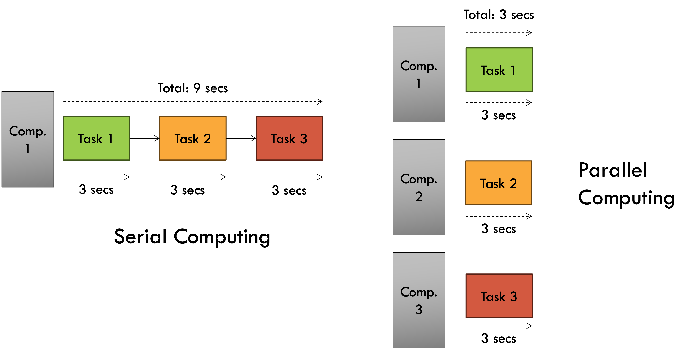
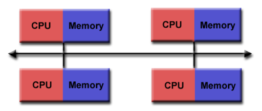
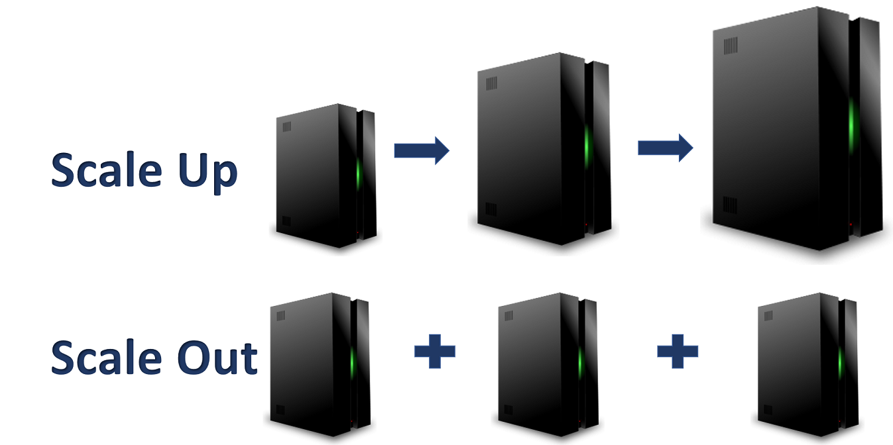

# Parallel & Distributed Computing

Nearly all modern computer systems utilise parallel computing to speed up the execution of algorithms. To see how this works in practice look at the diagram below.

As you can see, in a scenario where a program (job) takes 3 seconds and 3 independent jobs have to be executed by a system, doing it serially in a single computer takes a total of 9 seconds. But doing it simultaneously across 3 computers will only take 3 seconds thus achieving a 3x speedup through parallel computing. 

This is the fundamental principle that High Performance Computing is based on.

## What is Distributed Computing? 

**Distributed computing is parallel execution on a distributed memory architecture.**

This essentially means it is a form of parallel computing, where the processing power is spread across multiple machines in a network rather than being contained within a single system. In this memory architecture, the problems are broken down into smaller parts, and each machine is assigned to work on a specific part.

### Distributed Memory Architecture

Lets have a look at the distributed memory architecture in more details.

- Each processor has its own local memory, with its own address space
- Data is shared via a communications network using a network protocol, e.g Transmission Control Protocol (TCP), Infiniband etc..

Each machine or **node** is connected to the HPC cluster via a network, typically one with high bandwidth and low latency. The fact that these are largely independent computers connected over a network rather than a set of CPU/GPU cores in the same computer (in parallel computing), presents a set of disadvantages.

### Advantages of parallel & local computing:
- Less **data transfer latency** than a distributed system. The system bus inside a machine has a much lower latency compared to even the fastest computer networks.
- No need to deal with **network congestion** related issues and complexities involved in setting up, connecting and managing networks.
- Inter-process communication is **a lot simpler** on a local computer compared to a distributed system (can just use OpenMP instead of MPI).

On the other hand, there is a reason why most modern computer systems - both cloud & HPC, use distributed computing.

## Scaling Up vs Scaling Out

Any time you want to make a computer system more powerful you have two choices - you either scale "up" or you scale "out".
- __Scale up:__ This involves the most intuitive way to increase computational capability. Simply upgrade your system to have more powerful hardware i.e. Increased RAM memory, CPU frequency, no. of cores, etc...
- __Scale out:__ This is where distributed and parallel computing shines. Instead of upgrading the hardware of existing systems, you just add more computers (node) to the system and use distributed computing software to take advantage of the expanded network.

### Advantages of distributed computing (scaling out):
- It's usually cheaper and **better value for money** to add new, cheap computers (nodes) to a HPC cluster than rotate existing computers with upgraded hardware.
- Better redundancy and **disaster recovery** when you're relying on more than one computer. Adding more nodes to your system allows you to do things like duplicate data and prepare for system meltdowns.
- Fewer **I/O bottleneck** issues. In a single computer there's only so many additional CPU cores, RAM and secondary storage you can add before the memory addressing system faces bottlenecks. A distributed computing system has nodes with their own individual processors and memory.

And finally, not everything needs to be done on a parallel or distributed system. There are certain issues with this paradigm (explored in more detail in later chapters) that result in certain advantages for serial computing.

### Advantages of serial computing:
- **More simple** to design & implement algorithms. Parallel algorithms can get quite complex, especially when dealing with more complicated instructions with dependencies.
- **Less overhead** involved in managing a parallel & distributed job. No need to manage data sharing between threads, processes, nodes, etc...
- **No synchronisation issues** & headaches involved in concurrent computing. Don't have to deal with race conditions, deadlocks, livelocks, etc...