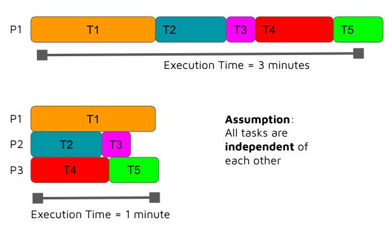

# Refresher on Parallelism

## Task Parallelism

We saw in the last chapter parallel computing can be used to solve problems by executing code in parallel as opposed to in series.

## Data Parallelism

Note that not all programs can be broken down into independent tasks and we might instead data parallelism like the following.

## Parallel computing example

Think back to the example below which was provided in the last chapter. We will look at the cost of memory transactions soon.

The speed up achieved from parallelism is dictated by your algorithm. Notably the serial bits of your algorithm can not be sped up by increasing the number of processors. The diagram below looks at the benefits we can achieve from writing parallel code as the number of processes increases.

## Parallel Scalability

## Memory Architectures

Lastly, the different memory architectures we looked at in the last section included shared memory, distributed memory and hybrid architectures. We have looked at shared memory in detail and now we will dive into distributed memory architecture.

