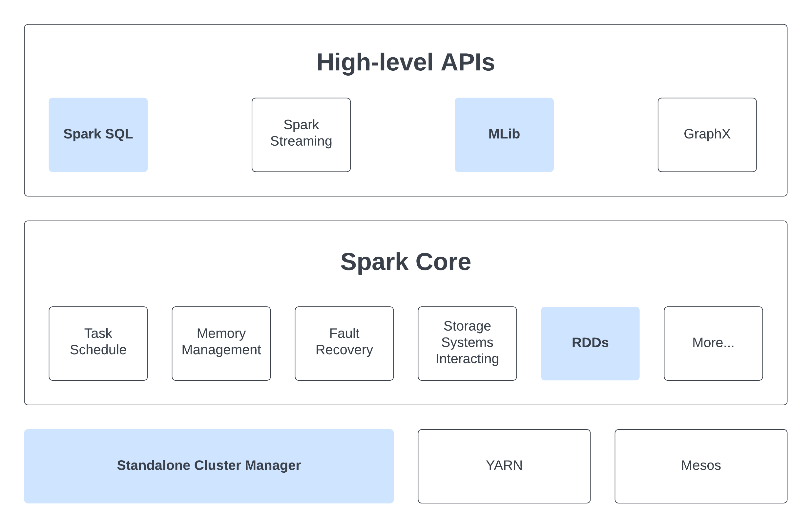

# Spark Architecture Overview

Here is a diagram representing components of Apache Spark:



> Within this chapter, we only look at components with blue boxes.

## Cluster Managers

Spark is designed to smoothly scale from just one compute node to potentially thousands. It achieves this scalability while prioritizing flexibility by supporting various cluster managers, including Hadoop YARN, Apache Mesos, and its own Standalone Scheduler. For our setup, we've opted for the simplicity of the Standalone Scheduler to run a mini-cluster in the last section.

## Spark Core - Resillient Distributed Datasets (RDDs)

### What is RDDs?

An RDD is simply a immutable distributed collection of objects. Within Spark, all tasks involve either generating new RDDs, modifying existing ones, or executing operations on RDDs to produce an outcome. Behind the scenes, Spark seamlessly disperses the data stored within RDDs into multiple partitions across your cluster and parallelizes the tasks you execute on them. Moreover, RDD can accommodate Python, Java, or Scala objects of any type, including user-defined classes. RDDs enable users to explicitly `persist` intermediate outcomes in memory, `control their partitioning` to optimize data distribution, and manipulate them using a diverse `set of operators`.

### Initialize RDD

#### Parallelize Collections

We can create a RDD from an existing iterable or collection

```python
data: list = ["H", "e", "l", "l", "o", "!"]

# by default, set the number of partitions automatically based on your cluster
chars: RDD = spark_context.parallelize(data)

# you can also set it manually by passing it as a second parameter to parallelize
chars: RDD = spark_context.parallelize(data, 10)
```

#### Read from External Datasets

PySpark can create distributed datasets from any storage source supported by Hadoop, including your local file system, HDFS, Cassandra, HBase, Amazon S3,...

```python
# takes a URI for the file (either a local path on the machine, or a hdfs://, s3a://, etc URI)
# reads it as a collection of lines
lines: RDD = spark_context.textFile("/path/to/hello.txt")
```

Once created, RDD can be performed on by a diverse list of functional-style operations.

### RDD Operations

#### Transformations and Actions

RDDs support two types of operations `transformations` and `actions`: 
- Transformations are operations on RDDs that return a new RDD by applying the same operation to many data items. Transformations are `lazily evaluated` (including loading data), it will only be computed when an action is called. Spark internally records metadata to indicate that a transformation has been requested.
- Actions are operations that run computation on a RDD then return a value (non-RDD) or export data to a storage system.

#### Why laziness?

Many popular cluster computing frameworks (such as MapReduce and Dryad) offer high-level operators for parallel computations, simplifying work distribution and fault tolerance concerns. However, they lack abstractions for efficiently optimizing distributed memory when dealing with applications that frequently reuse intermediate results ([iterative methods](https://en.wikipedia.org/wiki/Iterative_method), [interactive data mining](https://en.wikipedia.org/wiki/Data_mining), etc).
  
Within the majority of these frameworks, the exclusive method for reusing data between computations (e.g., between two MapReduce jobs) involves storing it in an external stable storage system, such as a distributed file system, resulting in significant overhead due to data replication, disk I/O operations, and serialization. Therefore, we will often have to spend time considering how to group together operations to minimize the number of MapReduce passes through our data.

> Spark employs lazy evaluation to:
> - Minimize the number of passes it makes over the data by consolidating operations.
> - Allow more rich and flexible combinations of Transformations.

#### APIs Reference

A complete list of PySpark APIs is available at [Apache Spark Documentation](https://spark.apache.org/docs/latest/api/python/reference/index.html). If you're ever uncertain about whether a specific function is a transformation or an action, simply check its return type: `transformations` return `RDDs`, whereas `actions` return some `other data type`.

#### Examples

Let's look at a few simple examples of using PySpark

> You should follow these examples on a JupyterLab connecting to a Spark Cluster

##### Monte Carlo Pi Estimation

```python
import pyspark
from pyspark.sql import SparkSession
from random import random
from operator import add

# Set this to the name of the current master node of the Spark Cluster
# Eg: master_node = "m3i014"
master_node = ...

###### Initilize Spark Session ######
spark = SparkSession \
    .builder \
    .master(f"spark://{master_node}.massive.org.au:7077") \
    .appName("PythonJupyter") \
    .config("spark.workers.show", "True") \
    .getOrCreate()

###### Monte Carlo Pi Estimation ######

partitions = 4
n = 100000000 * partitions
data = range(1, n + 1)

def point(_: int) -> float:
    x = random() * 2 - 1
    y = random() * 2 - 1
    return 1 if x ** 2 + y ** 2 <= 1 else 0

count = spark
    .sparkContext \
    # distribute data into partitions across cluster, we have the starting RDD here
    .parallelize(data, partitions) \
    # Transformation: map each data through a function, resulting in a new RDD
    .map(point) \
    # Action: Reduce all the data into a value
    .reduce(add)

print("Pi is roughly %f" % (4.0 * count / n))
```

##### Sort a Text File

```bash
# Randomly generate number and store in a file called "rand_ints.csv"
# Note: This is bash command
for i in {1..1000}; do echo $[($RANDOM)]; done > ./rand_ints.csv
```

```python
from typing import Tuple
from pyspark.rdd import RDD
from pyspark.sql import SparkSession

# Set this to the Path of the file rand_ints.csv
# Note: Don't use Relative Path
file_path = ...
lines = spark \
    .read \
    .text(file_path) \
    .rdd \
    .map(lambda r: r[0])

sortedCount: RDD[Tuple[int, int]] = lines \
    .flatMap(lambda x: x.split(' ')) \
    .map(lambda x: (int(x), 1)) \
    .sortByKey()

# This is just a demo on how to bring all the sorted data back to a single node.
# In reality, we wouldn't want to collect all the data to the driver node.
output = sortedCount.collect()
for (num, unitcount) in output:
    print(num)
```
