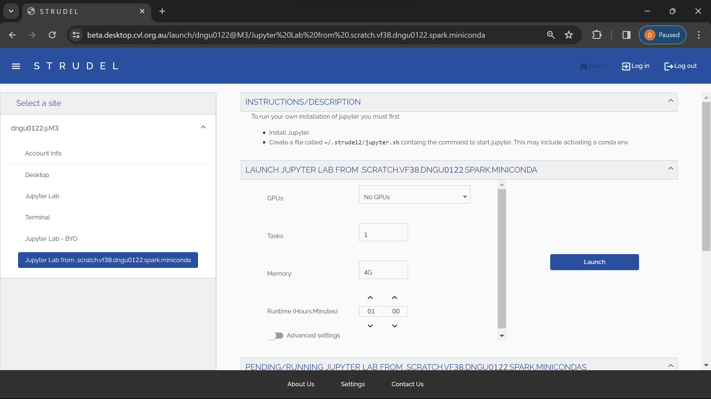

# Setting up a Spark cluster within M3 cluster

The overall process can be demonstrated through this diagram: TODO

## Installation

Different Spark version may have different version requirements for Python and Java. We will use Spark 3.5, Python 3.10 (JupyterLab Environment), and Java 8 (default in M3). There are 2 main things that we need to set up:

- **Miniconda**

Conda can be installed using the conda-install module from M3. The JupyterLab environment currently uses Python 3.10, meeting the prerequisite for Spark 3.5. This environment will also be utilized for running a notebook in STRUDEL. For those interested in customizing their own conda environment on M3, detailed instructions can be found in [this instruction](https://docs.massive.org.au/M3/connecting/strudel2/connecting-to-byo-jupyter.html).

```bash
module load conda-install
conda-install
```

- **Spark Engine**

Since M3 does not include a built-in module for Spark, we need to download and unzip it. Other versions can be found [here](https://spark.apache.org/downloads.html)

```bash
# Spark 3.5.0
wget https://dlcdn.apache.org/spark/spark-3.5.0/spark-3.5.0-bin-hadoop3.tgz
tar xzfv spark-3.5.0-bin-hadoop3.tgz
rm -rf spark-3.5.0-bin-hadoop3.tgz
```

## Getting the cluster running

### Requesting nodes from M3

We can refer to the [M3 chapter](/chapter3/slurm.md) to request an interactive session. E.g:
```bash
# Interactive session with: 12 cpus, 1 hour of time, 4 nodes, 8gb memory per node on m3i partion
smux new-session --jobname=testing_spark --ntasks=4 --time=0-01:00:00 --partition=m3i --mem=8GB --nodes=4 --cpuspertask=4
```

### Setting up worker

- Write requested nodes name to the config file within spark
```bash
# Get names of all nodes
# Read from 2nd node to the last node (as the 1st node is the master node)
# Write it to the config file workers within spark engine
scontrol show hostnames | sed -n '2,$p' > /path/to/spark-3.5.0-bin-hadoop3/conf/workers
```

### Starting spark cluster

- Start the cluster
```bash
source /path/to/spark-3.5.0-bin-hadoop3/sbin/start-all.sh
```

## Connecting Jupyter Lab (STRUDEL) to the Cluster

### Requesting a notebook through STRUDEL

When installing miniconda in M3, there will be a built-in environment named ```jupyterlab```. This environment will also be automatically added into STRUDEL and we can launch a JupyterLab session from this environment.



### Exporting environments variables

```python
import sys
import os

# Specify paths, which will be set as environment variables and read by the Spark engine
SPARK_HOME = "/path/to/spark-3.5.0-bin-hadoop3"
os.environ["SPARK_HOME"] = SPARK_HOME
PREV_PATH = os.environ["PATH"]
os.environ["PATH"] = f"{SPARK_HOME}/bin:{PREV_PATH}"

# Specify which Python to be used by the driver and workers
os.environ["PYSPARK_PYTHON"] = sys.executable

# Add pyspark to the PYTHONPATH
PYSPARK_HOME=f"{SPARK_HOME}/python"
sys.path.append(PYSPARK_HOME)

# Different Spark version will have different py4j version
sys.path.append(f"{PYSPARK_HOME}/lib/py4j-0.10.9.7-src.zip")
```

### Connecting to the spark master

```python
import pyspark
from pyspark.sql import SparkSession

spark = SparkSession \
    .builder \
    .master("spark://{master_node}.massive.org.au:7077") \
    .appName("test") \
    .config("spark.workers.show", "True") \
    .getOrCreate()
```

### SSH Tunnel SparkUI to Localhost

We can use [ssh tunneling](https://www.ssh.com/academy/ssh/tunneling) to forward the Spark UI of the engine to our local machine, the UI will be available as a nice web interface at ```http://localhost:4040```.

```bash
# The jupyterlab node will be the node that the jupyter lab is currently running on
ssh -L 4040:{jupyterlab_node}.massive.org.au:4040 {username}@m3.massive.org.au
```

