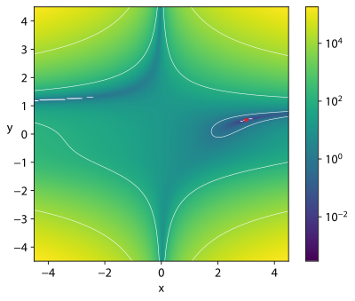

# Optimisation Algorithms

Optimisation algorithms are a family of algorithms which aim to find the best combination of some variables,
to maximise (or minimise) some kind of output.
Though that may sound quite abstract,
optimisation algorithms can in fact be applied to a variety of different practical problems.
Some examples where optimisation algorithms could be used include:

- An bakery trying to figure out which ingredients to buy to maximise profit
- A small business owner attempting to create the 'optimal' shift for their workers
- A deep learning engineer trying to find the best parameters for their artificial intelligence model

Though at surface level all these problems may look appear quite different,
each of these situations can be modelled mathematically in similar ways,
allowing us to use techniques from linear algebra to help us out.

# Linear Algebra

One can think of optimisation algorithms as an attempt to answer the question "what is the best choice one can make right now?"
In order to find the *best* choice, we should figure out some way to organise the choices we *can* make.

In virtually all cases, one can model the list of all choices as just a list of numbers, with each number corresponding to one parameter that can be adjusted, for example

- If the bakery has 10 ingredients, then the numbers could be an (ordered) list of the amount of each ingredient
- The small business owner can represent a whole shift as a list of numbers, each number corresponding the shifts of each worker
- The deep learning engineer probably has a list of parameters already, and they just need to fine tune the coefficients

This is very similar to the coordinate system taught in high school.
The same way we think of two numbers in a coordinate system as a point on the plane (like (0,0) being at the centre of the xy plane),
we can think of these lists of numbers as points on some higher dimensional plane.
See how even in the small example of the bakery with 10 ingredients, we're already dealing with 10 dimensional space.
With the small AI, one might use a model with 128 parameters.
Meaning, the mathematic represents some kind of 128-dimensional space.

If you can't imagine 128 dimensions of space, that's fine.
what's important is that the logic and systems that are true in 2 or 3 dimensions are also true in higher dimensions.
The analogy of "points in space" will also be useful in a bit.
In mathematics jargon, one could say an optimisation problem with *n* variables can be modelled as a vector space with *n+1* dimensions.
Why *n+1*? see below.

# Cost Function

Once we have a way of describing all the choices we can make, we need a way of saying how good each choice is.
In other words,
we need to take each point in our space,
and associate this with some metric of "goodness".
The better that point is, the higher number it receives.
Mathematically,
one would conceptualise this as a function which takes in the parameters as input,
and outputs something outside of those parameters.
That's where the extra *+1* variable comes from

This metric would arise naturally out of the problem we are trying to study.
For the bakery example, it would be something like how much profit each choice can generate.
In the AI example, it would probably be the performance of the model.

# Why do we need these algorithms?

Here's an exercise:

Draw a square of radius 10 and fill in with a bunch of dots in random positions.
Then, cut out 10 circles of radius 1.
Now I ask you the question,
how many dots can you cover at most?

This is a very strange question,
and its not immediately obvious how one would approach this problem.
if the points were laid out in front of us,
a human could probably intuit the best placement of circle cut outs.
But building an algorithm that can reliably cover a good amount of circles is quite difficult.

That's the point of these algorithms.
To construct a way for computers to mimic the human intuition of a strange and complicated problem.
We'll see some algorithms that can do that in a bit.
But first, some more weird functions.

# strange functions

Here's some images of the output of functions

These are the Beale Contour,  Rastrigin Contour, and the Rosenbrock Contour respectively.
Notice that it is not immediately obvious how a computer should determine the minima (or maxima) of these functions.
Checking every single point becomes radically exhaustive extremely quickly.

# Algorithms

personally, I view these algorithms as the *definition* of machine learning.
As in, training an artificial intelligence model is essentially a quest to find the right numbers to put into a model,
such that said model performs optimally.

## Gradient Descent

*differentiable* functions

## Genetic Algorithm

## Constraint programming

# Relation to HPC
