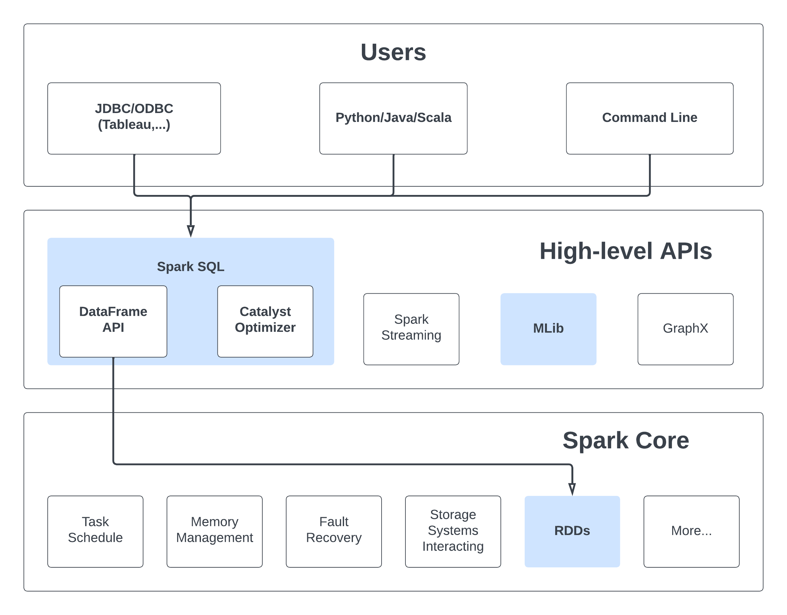

# Data Processing with Spark

## Spark SQL

Spark SQL, a module of Spark, is designed for structured data processing. Unlike the basic Spark RDD API, the interfaces in Spark SQL offer more details about the data's structure and the ongoing computation. Internally, Spark SQL utilizes this additional information to make optimizations for improved performance.

### Architecture Overview



### Capabilities

Spark SQL provides 3 main capabilities:
- Load data from a variety of structured sources (e.g., JSON, Hive, and Parquet).
- Query the data using SQL, both inside a Spark program and from external tools that connect to Spark SQL through standard database connectors (JDBC/ODBC), such as business intelligence tools like Tableau.
- Provides rich integration between SQL and regular Python/Java/Scala code, including the ability to join RDDs and SQL tables, expose custom functions in SQL, and more. Many jobs are easier to write using this combination.

### Datasets and DataFrames

A Dataset represents a distributed assembly of data, combining the advantages of Resilient Distributed Datasets (RDDs) with the efficiency of Spark SQL's optimized execution engine.

Meanwhile, a DataFrame is a structured form of a Dataset, arranged into columns. It parallels the notion of a table in a relational database or a data frame in languages like R or Python, yet incorporates more sophisticated optimizations internally.

### Working with PySpark DataFrames

> We will now have a look at the examples provided in ```path/to/spark-3.5.0-bin-hadoop3/examples/src/main/python/sql/basic.py```
