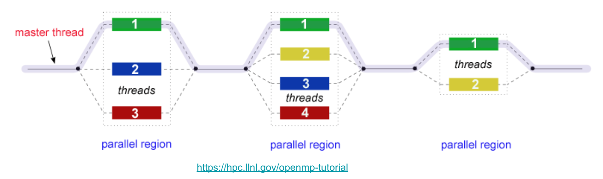
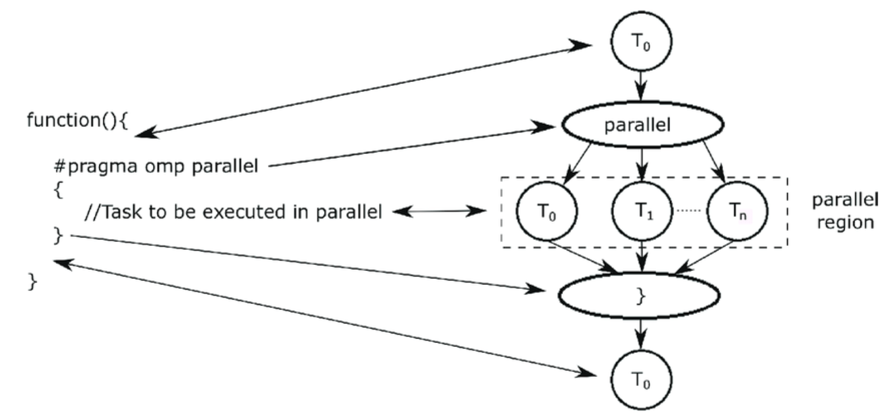

# Multithreading

## What is Multithreading?

### Motivation

### Process vs Thread

### Shared Memory

## OpenMP

OpenMP is an Application Program Interface (API) that is used to explicitly direct multi-threaded, shared memory parallelism in C/C++ programs. It is not intrusive on the original serial code in that the OpenMP instructions are made in pragmas interpreted by the compiler.

> Further features of OpenMP will be introduced in conjunction with the concepts discussed in this chapter.

### Fork - Join Model

OpenMP uses the `fork-join model` of parallel execution.

* **FORK**: All OpenMP programs begin with a `single master thread` which executes sequentially until a `parallel region` is encountered, when it creates a team of parallel threads.

The OpenMP runtime library maintains a pool of threads that can be added to the threads team in parallel regions. When a thread encounters a parallel construct and needs to create a team of more than one thread, the thread will check the pool and grab idle threads from the pool, making them part of the team.

* **JOIN**: Once the team threads complete the parallel region, they `synchronise` and return to the pool, leaving only the master thread that executes sequentially.



> We will look a bit more into what is synchronisation as well as synchronisation techniques in the next sub-chapter.

### Imperative vs Declarative

Imperative programming specifies and directs the control flow of the program. On the other hand, declarative programming specifies the expected result and core logic without directing the program's control flow.

OpenMP follows a declarative programming style. Instead of manually creating, managing, synchronizing, and terminating threads, we can achieve the desired outcome by simply declaring it using pragma.



### Working with OpenMP

We will now look at a simple example.

> The code can be compiled with `gcc -fopenmp -o hello hello.c`.

#### Parallel For Loops

```c
#include <omp.h>
#include <stdio.h>

int main() {
    int i;
    #pragma omp parallel for
    for (i = 0; i < 10; i++) {
        printf("Thread %d executing iteration %d\n", omp_get_thread_num(), i);
    }
    return 0;
}
```

## Running on M3