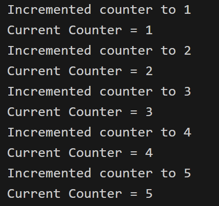
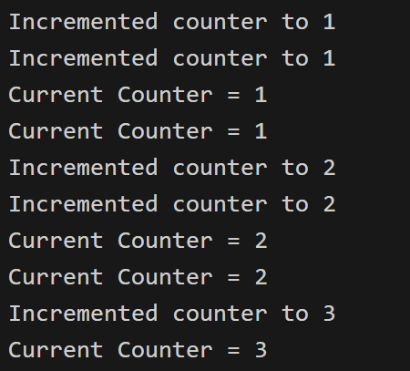

# Synchronisation

## Race Condition

Let's start with this simple program:

```c
/*
We purposefully added the following code within the program:
- The sleep() calls allow thread switching in the middle of function calls.
- The silly variable assignments in increment() mimic the register.
- All functions are sharing a global counter variable.

Note that:
- Even if we remove all of the sleep() and the variable assignments,
the error can still occur by chance.

What should be the desired output?
What is the actual output?
*/
#include <omp.h>
#include <stdio.h>
#include <unistd.h>

float sleep_time = 0.1;
int counter = 0;                                    // Sharing across the program

int get_value() {
    sleep(sleep_time);                              // This will cause thread switching
    printf("Current Counter = %d\n", counter);
    return counter;
}

void increment() {
    int temp = counter;                             // Load counter to register
    sleep(sleep_time);                              // This will cause thread switching
    temp++;                                         // Increment the register
    counter = temp;                                 // Store back to the variable

    printf("Incremented counter to %d\n", counter);
}

int main() {
#pragma omp parallel for
    for (int i = 0; i < 5; i++) {
        increment();
        get_value();
    }
    
    return 0;
}
```

### Single Thread

Running the program using 1 thread:
```bash
export OMP_NUM_THREADS=1
./counter
```
The output should look something like this:



The output coordinates with what we expected.
- This is because we only used 1 single thread.
- The program is just a sequential program without any parallism. 
- `sleep()` calls simply put the thread to sleep, that same thread will go to sleep, wake up, and continue the execution.

### Multiple Threads

Running the program using 2 threads may give us this output (this is just 1 **possible** output):



What is happening here?
- We are using 2 threads.
- Both threads are trying to access the global variable `counter` at the same time (roughly).
- During the time when 1 thread is sleeping, the other thread may increment the shared counter.
- The 2 threads simply go on their way and not coordinate with each other.

> What we are having here is `Race Condition`. A race condition occurs when two or more threads can access `shared data` and they try to `change it at the same time`.

### How to resolve the problem?

There are a few ways we can resolve the race condition:

* Critical Directive: This restricts the code so that only one thread can do something at a time (in our example, only 1 thread can increment the counter at a time). However, it is `bad for performance` and possibly destroy a lot of the gains from running code in parallel in the first place.

```c
int main() {
#pragma omp parallel for
    for (int i = 0; i < 5; i++) {
#pragma omp critical                                // Critical Directive
        increment();
        get_value();
    }
    return 0;
}
```

* Atomic Directive: This is quite similar to Critical Directive, however, it only applies to memory read/write operations. It has a slightly better performance than the Critical Directive. Let's look at another example:

> Run this program multiple times using multiple threads. Again, race condition!

```c
#include <omp.h>
#include <stdio.h>

int total = 0;
int n = 100;
int nums[100];

int main() {
    // Populate nums
    for (int i = 0; i < n; i++) {
        nums[i] = i;
    }

#pragma omp parallel for
    for (int i = 0; i < n; i++) {
        int temp = nums[i];
        /*
        We can easily resolve the race condition with atomic/critical directive.
        The atomic one will work perfectly and give better performance this time.
        Uncomment the directive below to resolve the race condition.
        */
// #pragma omp atomic
        total += temp;
    }
    printf("%d\n", total);
}
```

* Reduction Directive: Based on the problem, the best solution will be to use `reduction`. Let's analyse what this code is doing:

```c
#include <omp.h>
#include <stdio.h>

int total = 0;
int n = 100;
int nums[100];

int main() {
    // Populate nums
    for (int i = 0; i < n; i++) {
        nums[i] = i;
    }

#pragma omp parallel for reduction(+:total)
    for (int i = 0; i < n; i++) {
        int temp = nums[i];
        total += temp;
    }
    printf("%d\n", total);
}
```

> We will look into the theory of reduction more closely in the sub-chapter [Map Reduce](./map-reduce.md)


## Deadlocks

## Livelocks
