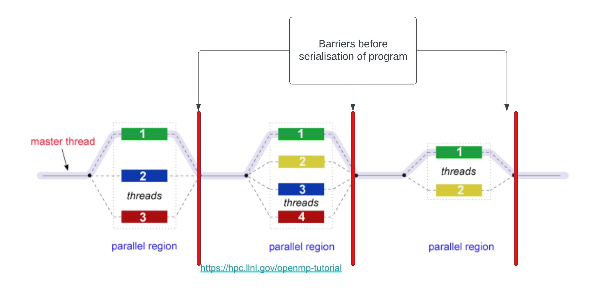
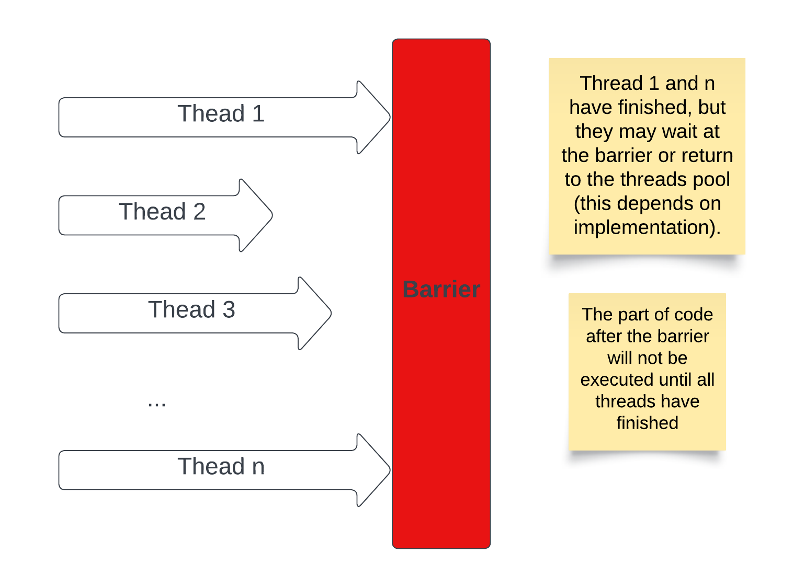
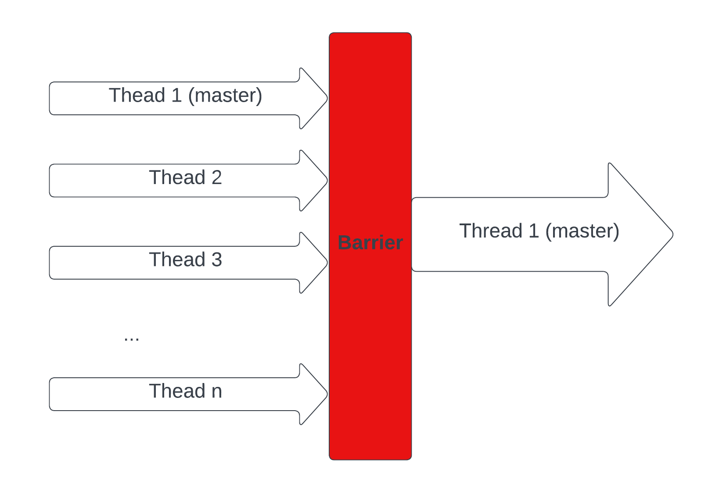
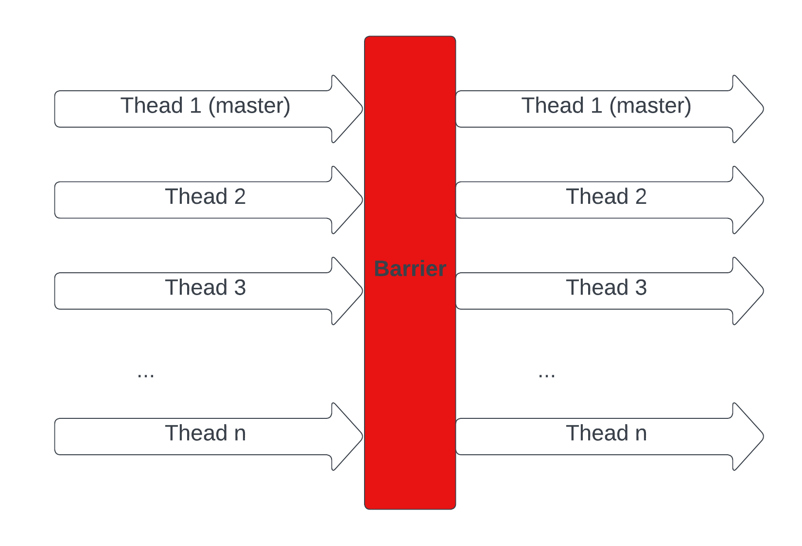

# Synchronisation

Synchronisation is the task of coordinating multiple of processes (or threads) to join up or handshake at a certain point, in order to reach an agreement or commit to a certain sequence of action.

## Race Condition

Let's start with this simple program:

```c
/*
We purposefully added the following code within the program:
- The sleep() calls allow thread switching in the middle of function calls.
- The silly variable assignments in increment() mimic the register.
- All functions are sharing a global counter variable.

Note that:
- Even if we remove all of the sleep() and the variable assignments,
the error can still occur by chance.

What should be the desired output?
What is the actual output?
*/
#include <omp.h>
#include <stdio.h>
#include <unistd.h>

float sleep_time = 0.1;
int counter = 0;                                    // Sharing across the program

int get_value() {
    sleep(sleep_time);                              // This will cause thread switching
    printf("Current Counter = %d\n", counter);
    return counter;
}

void increment() {
    int temp = counter;                             // Load counter to register
    sleep(sleep_time);                              // This will cause thread switching
    temp++;                                         // Increment the register
    counter = temp;                                 // Store back to the variable

    printf("Incremented counter to %d\n", counter);
}

int main() {
#pragma omp parallel for
    for (int i = 0; i < 5; i++) {
        increment();
        get_value();
    }
    
    return 0;
}
```

### Single Thread

Running the program using 1 thread:
```bash
export OMP_NUM_THREADS=1
./counter
```
The output should look something like this:


The output coordinates with what we expected.
- This is because we only used 1 single thread.
- The program is just a sequential program without any parallism. 
- `sleep()` calls simply put the thread to sleep, that same thread will go to sleep, wake up, and continue the execution.

### Multiple Threads

```bash
export OMP_NUM_THREADS=2
./counter
```

Running the program using 2 threads may give us this output (this is just 1 **possible** output):


What is happening here?
- We are using 2 threads.
- Both threads are trying to access the global variable `counter` at the same time (roughly).
- During the time when 1 thread is sleeping, the other thread may increment the shared counter.
- The 2 threads simply go on their way and not coordinate with each other.

> What we are having here is `Race Condition`. A race condition occurs when two or more threads can access `shared data` and they try to `change it at the same time`.

### How to resolve the problem?

There are a few ways we can resolve the race condition in OpenMP:

* **Critical construct**: This restricts the code so that only one thread can do something at a time (in our example, only 1 thread can increment the counter at a time). However, it is `bad for performance` and possibly destroy a lot of the gains from running code in parallel in the first place.

```c
int main() {
#pragma omp parallel for
    for (int i = 0; i < 5; i++) {
#pragma omp critical                                // Critical construct
        increment();
        get_value();
    }
    return 0;
}
```

* **Atomic construct**: This is quite similar to Critical construct, however, it only applies to memory read/write operations. It has a slightly better performance than the Critical construct. Let's look at another example:

> Run this program multiple times using multiple threads (before uncommenting the construct). Again, race condition!

```c
#include <omp.h>
#include <stdio.h>

int total = 0;
int n = 100;
int nums[100];

int main() {
    // Populate nums
    for (int i = 0; i < n; i++) {
        nums[i] = i;
    }

#pragma omp parallel for
    for (int i = 0; i < n; i++) {
        int temp = nums[i];
        /*
        We can easily resolve the race condition with atomic/critical construct.
        The atomic one will work perfectly and give better performance this time.
        Uncomment the construct below to resolve the race condition.
        */
// #pragma omp atomic
        total += temp;
    }
    printf("%d\n", total);
}
```

* **Reduction**: Based on the nature of the program, sometimes, the best solution will be to use `reduction`. Let's analyse what this code is doing:

> Using `reduction` here results in significantly better performance.
> - A quick way to do some simple benchmarking is: `time a-command`
> - Conduct benchmarking for 3 versions, and trying in different number of threads

Example:
```bash
# Tuning the number of threads
export OMP_NUM_THREADS=4

# Change according to your file's name
time ./critical
time ./atomic
time ./reduction
```

```c
#include <omp.h>
#include <stdio.h>

int total = 0;
int n = 100;
int nums[100];

int main() {
    // Populate nums
    for (int i = 0; i < n; i++) {
        nums[i] = i;
    }

#pragma omp parallel for reduction(+:total) num_threads(3)
    for (int i = 0; i < n; i++) {
        int temp = nums[i];
        total += temp;
    }
    printf("Final total is: %d\n", total);
}
```

> We will look into the theory of reduction more closely in the sub-chapters [Multithreading Map Reduce](./multithreading-map-reduce.md) and [Distributed Map Reduce](./distributed-map-reduce.md).


## Barrier Synchronisation

In the last sub-chapter, we have talked about the [Fork - Join Model](./multithreading.md#fork-join-parallel-execution-model). We know that **"Once the team threads complete the parallel region, they `synchronise` and return to the pool, leaving only the master thread that executes sequentially."**. However, there are a few important aspects that we have left out:
- The time taken to finish the assigned task is **different** for each thread.
- How can OpenMP know/identify **when** a thread has completed its own task.
- How can OpenMP know/identify **when** all threads have finished all the tasks.

The answer lies in something called **Barrier Synchronisation**. Here are illustrations for the idea:







### Implicit Barriers

The barrier synchronisation implicitly (behind the scene) occur a lot at the end of constructs such as parallel construct ("`#pragma omp parallel`") and the end of worksharing constructs(loop, sections, single, and workshare constructs).

```c
#include <stdio.h>
#include <omp.h>

int main(void)
{    
    #pragma omp parallel {
        // Parallel code
        printf("Thread %d is executing...\n", omp_get_thread_num());
    }

    // Sequential code after the barrier
    printf("Main thread\n");
    return 0;
}
```

### Barrier Construct

The barrier construct specifies an **explicit** (We add the construct into the code by ourselves) barrier at the point at which the construct appears. The barrier construct is a stand-alone directive. Here is an illustration of the following code.



```c
#include <stdio.h>
#include <omp.h>

int main(void)
{    
    #pragma omp parallel
    {
        printf("Thread %d executes part 1\n", omp_get_thread_num());
        #pragma omp barrier

        // No thread will execute part 2 before part 1
        printf("Thread %d executes part 2\n", omp_get_thread_num());
    }
    return 0;
}
```

### Let's think about a way to implement a barrier

We don't need to know exactly how OpenMP implemented this feature, at least not right now (if you are interested in OpenMP implementation, [here](https://www.openmp.org/spec-html/5.0/openmpse25.html) could be a start). We can follow a rough simple approach:

- Let's assume we have `n` threads.
- We need a way to count how many threads that have finished, this can easily be done with a shared counter variable (be careful with race condition) among threads. When this counter reaches the number `n`, we will know that all threads have finished.
- We also need a mechanism to make a finished thread idle and **wait()** for other threads to finish.
- The last thread to finish has the responsibility of **notify()** other threads (threads that you want to be executed after the barrier).

Voila! we have a barrier. We will implement barrier as part of a mini-project using [Posix Thread](https://docs.oracle.com/cd/E26502_01/html/E35303/tlib-1.html) or [Java Threads](https://docs.oracle.com/javase/8/docs/api/java/lang/Thread.html).

## Join Synchronisation

## Deadlocks

## Livelocks
