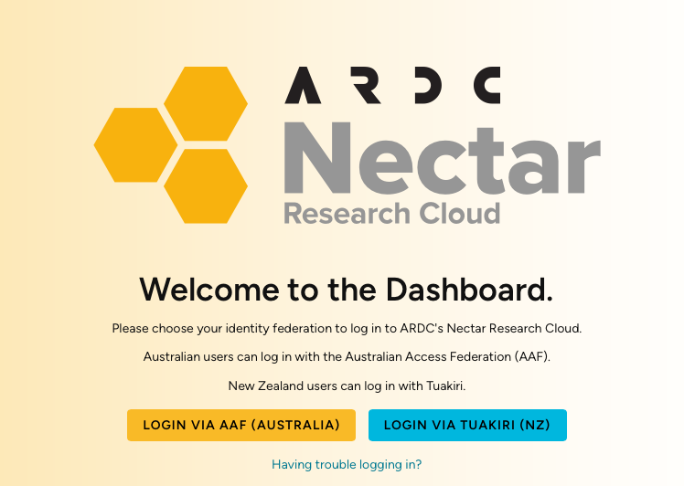

# Nectar Cloud

The ARDC Nectar Research Cloud (Nectar) is Australia’s national research cloud, specifically designed for research computing. Like with M3, we will set you up with access now before you learn about it in later chapters. [This webpage](https://ardc.edu.au/services/ardc-nectar-research-cloud/) explains what it is if you're curious.

## Connect Monash Account to Nectar Cloud
To create an [identity](https://medium.com/@ciente/identity-and-access-management-iam-in-cloud-computing-2777481525a4) (account) in Nectar Cloud, all you have to do is login using your Monash student account. Click [this link](https://dashboard.rc.nectar.org.au) to access Nectar's landing page.

You will see the following. Make sure to click "Login via AAF (Australia)".

You will be redirected to enter your Monash credentials after which you will see the Nectar Cloud dashboard for your trial project (your project name will be pt-xxxxx).

## Cloud Starter Series

ARDC has provided [this cloud starter tutorial series](https://tutorials.rc.nectar.org.au/cloud-starter/01-overview) for people new to Nectar Cloud. You should be able to follow these tutorials using your trial project. If you need more SUs (service units aka. cloud credits) in order to provision more cloud resources for MDN-related work, you should message your HPC Lead with that request.