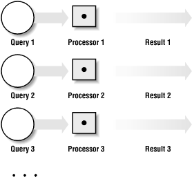

# Parallel Computing

As introduced in chapter 5, parallel computing is all about running instructions simultaneously on multiple computers rather than doing it all sequentially/serially on the same computer. This is relatively straightforward if we have multiple, completely independent tasks that don't need to share resources or data i.e. inter-query parallelism.

In this context, you can consider a query to be a job that carries out a series of steps on a particular dataset in order to achieve something e.g. a SORT query on a table. It's fairly straightforward to execute multiple queries at the same time using a parallel/distributed system but what if we want to parallelise and speed up the individual operations within a query?

This is where things like synchronisation, data/workload distribution and aggregation needs to be considered. In this chapter we will provide some theoretical context before learning how to implement parallelism using OpenMP & MPI.