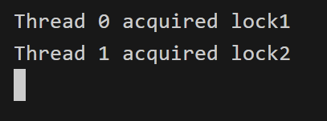

# Locks

Ealier, we have learnt about how to write concurrent programs, as well as a few constructs to achieve **synchronisation** in OpenMP. We know that:
- `reduction construct` partitions shared data and used a barrier to achieve synchronisation
- `atomic construct` utilises hardware ability to achieve thread-safe small memory read/write operations.

What about `critical construct`? We said that it uses locks, but what are locks?

> Notes that the direct use of locks is **not recommended** (at least in OpenMP):
> - It is very easy to cause a deadlock or hard-to-debug livelock (more on these at the end of this sub-chapter).
> - It can often cause very poor performance or worse.
> - It generally indicates that the program design is wrong.
>
> We will explore them because it is important to know about what is happening under the hood of the high-level APIs.

## Overall Idea

Lock is a synchronization technique. A lock is an abstraction that allows at most one thread to own it at a time. To be more concrete, let's say we have a segment of code, guarded by a **lock**. Then, exactly 1 thread can execute those lines of code at a time (Sounds familiar?). Any other threads (without the lock) trying to access the code segment will have to wait until the lock is released.

## OpenMP Locks

Let's start with an example:

```c
#include <omp.h>
#include <stdio.h>

int total = 0;
int n = 100;
int nums[100];
omp_lock_t lock;                        // uninitialized

int main() {

    omp_init_lock(&lock);               // the lock is initialized but unlocked

    // Populate nums
    for (int i = 0; i < n; i++) {
        nums[i] = i;
    }

#pragma omp parallel for
    for (int i = 0; i < n; i++) {
        int temp = nums[i];

        omp_set_lock(&lock);            // a thread changes the lock's state to locked

        total += temp;                  // something that we want only 1 thread execute at a time

        omp_unset_lock(&lock);          // the thread owning the lock changes the lock's state to unlocked
    }
    omp_destroy_lock(&lock);
    printf("%d\n", total);
}
```

An OpenMP lock can exist in three states: **uninitialized**, **unlocked**, or **locked**. When in the unlocked state, a task can acquire the lock, transitioning it to the locked state. The task acquiring the lock is considered its owner. An owning task can release the lock, reverting it to the unlocked state. Any attempt by a task to release a lock it does not own renders the program non-conforming.

There are two types of locks supported: simple locks and nested locks:
- Nested locks allow for multiple acquisitions before unlocking. They remain locked until unset as many times as `omp_set_nest_lock` has been called. Nested locks facilitate scenarios where functions call other functions utilizing the same lock.
- Simple locks should be acquired only once using `omp_set_lock` and released with a single call to `omp_unset_lock`.

## Deadlocks

When used correctly and cautiously, locks can effectively prevent race conditions. However, there's another issue to be aware of. Because using locks means that threads have to wait (blocking when another thread holds the lock), there's a risk of a situation where two threads end up waiting for each other, leading to a stalemate where neither can progress.

Let's look at this code:

```c
#include <stdio.h>
#include <omp.h>

omp_lock_t lock1, lock2;

int main() {
    omp_init_lock(&lock1);
    omp_init_lock(&lock2);

#pragma omp parallel num_threads(2)
    {
        int thread_id = omp_get_thread_num();

        if (thread_id == 0) {
            omp_set_lock(&lock1);                               // Thread 0 takes lock 1
            printf("Thread %d acquired lock1\n", thread_id);
            omp_set_lock(&lock2);                               // Attemp to take lock 2 (but already belongs to thread 1 => wait)
            printf("Thread %d acquired lock2\n", thread_id);
            omp_unset_lock(&lock2);
            omp_unset_lock(&lock1);
        }
        else {
            omp_set_lock(&lock2);                               // Thread 1 takes lock 2
            printf("Thread %d acquired lock2\n", thread_id);
            omp_set_lock(&lock1);                               // Attemp to take lock 1 (but already belings to thread 0 => wait)
            printf("Thread %d acquired lock1\n", thread_id);
            omp_unset_lock(&lock1);
            omp_unset_lock(&lock2);
        }
    }

    omp_destroy_lock(&lock1);
    omp_destroy_lock(&lock2);

    return 0;
}
```

The output should be something like this:



The program is not terminated. However, no thread is making any progress as they are being blocked by each other at the same time!

Deadlock is not just limited to two modules; the key characteristic of deadlock is a cycle of dependencies:
- A is waiting for B
- B is waiting for C
- C is waiting for A

In such a loop, none of the threads can move forward.

## Livelocks

A more challenging issue that may arise is livelock. Similar to deadlock, livelocked threads are unable to make progress. However, unlike deadlock, where threads are blocked, livelocked threads remain active. They're caught in a continuous and infinite sequence of responding to each other, preventing them from making any meaningful progress in their work.

```c
#include <stdio.h>
#include <omp.h>
#include <unistd.h>

omp_lock_t lock1, lock2;

void execute_task(int task_number) {
    omp_lock_t* first_lock;
    omp_lock_t* second_lock;
    const char* lock1_message;
    const char* lock2_message;

    if (task_number == 1) {
        first_lock = &lock1;
        second_lock = &lock2;
        lock1_message = "lock1";
        lock2_message = "lock2";
    }
    else {
        first_lock = &lock2;
        second_lock = &lock1;
        lock1_message = "lock2";
        lock2_message = "lock1";
    }

    while (1) {
        omp_set_lock(first_lock);
        printf("%s acquired, trying to acquire %s.\n", lock1_message, lock2_message);

        // sleep for 50 milliseconds to illustrate some meaningful tasks,
        // and to ensures that the order of lock and unlock can not correct itself by chance
        usleep(50000);

        if (omp_test_lock(second_lock)) {
            printf("%s acquired.\n", lock2_message);
        }
        else {
            printf("cannot acquire %s, releasing %s.\n", lock2_message, lock1_message);
            omp_unset_lock(first_lock);
            continue;
        }

        printf("executing task %d.\n", task_number);
        break;
    }
    omp_unset_lock(second_lock);
    omp_unset_lock(first_lock);
}

int main() {
    omp_init_lock(&lock1);
    omp_init_lock(&lock2);

// each section will be executed in parallel
#pragma omp parallel sections
    {
#pragma omp section
        {
            execute_task(1);
        }

#pragma omp section
        {
            execute_task(2);
        }
    }

    omp_destroy_lock(&lock1);
    omp_destroy_lock(&lock2);

    return 0;
}

```
