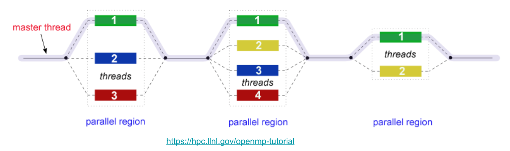

# Multithreading

Hopefully by now you are all familiar with multi-threading and how parallel computing works. We'll now go through how to implement parallel computing using OpenMP in order to speed up the execution of our C programs.

## OpenMP

OpenMP is an Application Program Interface (API) that is used to implement multi-threaded, shared memory parallelism in C/C++ programs. It's designed to be a very minimal add-on to serial C code when it comes to implementation. All you have to do is use the `#pragma` (C preprocessor directives) mechanism to wrap the parallel regions of your code.

### Fork-Join Parallel Execution Model

OpenMP uses the *fork-join model* of parallel execution.

* **FORK**: All OpenMP programs begin with a *single master thread* which executes sequentially until a *parallel region* is encountered. After that, it spawns a *team of threads* to carry out the multi-threaded parallel computing.

The OpenMP runtime library maintains a pool of potential OS threads that can be added to the thread team during parallel region execution. When a thread encounters a parallel construct (pragma directive) and needs to create a team of more than one thread, the thread will check the pool and grab idle threads from the pool, making them part of the team. 

This speeds up the process of thread spawning by using a *warm start* mechanism to minimise overhead associated with the kernel scheduler context switching needed to conduct thread spawning.

> If you're unclear how the kernel scheduler context switching works, revisit the operating systems chapter and explore/lookup the topics introduced there.

* **JOIN**: Once the team of threads complete the parallel region, they **synchronise** and return to the pool, leaving only the master thread that executes sequentially.



### Imperative vs Declarative

Imperative programming specifies and directs the control flow of the program. On the other hand, declarative programming specifies the expected result and core logic without directing the program's control flow i.e. you tell the computer what to do instead of *how to do it*.

OpenMP follows a declarative programming style. Instead of manually creating, managing, synchronizing, and terminating threads, we can achieve the desired outcome by simply declaring pragma directives in our code.


### Working with OpenMP

We will now look at a simple example.

> The code can be compiled with `gcc -fopenmp -o hello hello.c`.

```c
#include <omp.h>
#include <stdio.h>

int main() {
    int i;
    #pragma omp parallel for
    for (i = 0; i < 10; i++) {
        printf("Thread %d executing iteration %d\n", omp_get_thread_num(), i);
    }
    return 0;
}
```

## Running on M3

Here is a template script provided in the home directory in M3. Notice that we can dynamically change the number of threads using `export OMP_NUM_THREADS=12`.

> The `export` statement is a bash command you can type into a WSL/Linux terminal. It allows you to set environment variables in order to manage runtime configuration.

```bash
#!/bin/bash
# Usage: sbatch slurm-openmp-job-script
# Prepared By: Kai Xi,  Apr 2015
# NOTE: To activate a SLURM option, remove the whitespace between the '#' and 'SBATCH'

# To give your job a name, replace "MyJob" with an appropriate name
# SBATCH --job-name=MyJob

# To set a project account for credit charging,
# SBATCH --account=pmosp

# Request CPU resource for a openmp job, suppose it is a 12-thread job
# SBATCH --ntasks=1
# SBATCH --ntasks-per-node=1
# SBATCH --cpus-per-task=12

# Memory usage (MB)
# SBATCH --mem-per-cpu=4000

# Set your minimum acceptable walltime, format: day-hours:minutes:seconds
# SBATCH --time=0-06:00:00

# To receive an email when job completes or fails
# SBATCH --mail-user=<You Email Address>
# SBATCH --mail-type=END
# SBATCH --mail-type=FAIL

# Set the file for output (stdout)
# SBATCH --output=MyJob-%j.out

# Set the file for error log (stderr)
# SBATCH --error=MyJob-%j.err

# Use reserved node to run job when a node reservation is made for you already
# SBATCH --reservation=reservation_name

# Command to run a openmp job
# Set OMP_NUM_THREADS to the same value as: --cpus-per-task=12
export OMP_NUM_THREADS=12
./your_openmp_program
```
