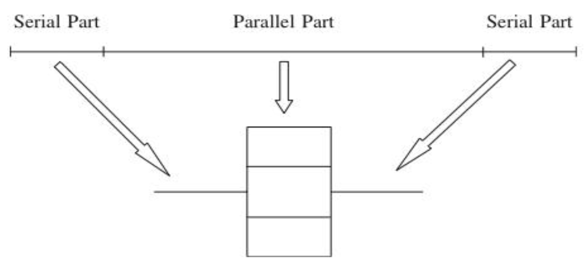
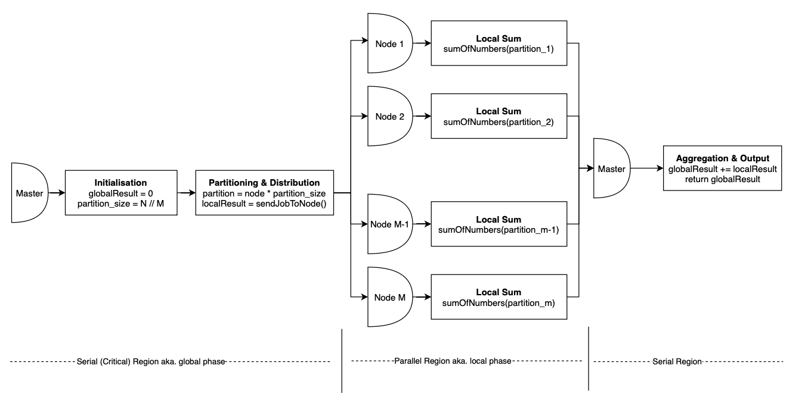

# Parallel Algorithms

You can think of all parallel algorithms as having a serial portion and a parallel portion i.e. local and global phases.



> This applies to both local parallel computing between CPU cores with a shared RAM as well as distributed computing between multiple HPC nodes with a distributed memory architecture. The only difference between the two is additional complexities involved in managing data sharing & sending instructions across a network.

Let's go through this with a simple example. To calculate the sum of all numbers between 1 to N serially, you would execute the following pseudocode,

```
function sumOfNumbers(N):
    result = 0

    for x from 1 to N:
        result += x

    return result
```

To do this in parallel (assuming you have M processors/nodes) you would do something like this,

```
function parallelSum(N):
    globalResult = 0
    partition_size = N // M

    for node from 1 to M:
        partition = node * partition_size
        localResult = sendJobToNode(node, sumOfNumbers(partition))
        globalResult += localResult
    
    return globalResult
```

This is how one of the simplest parallel algorithms - **parallel sum** works. All lines of code beside the `sendJobToNode` function call are executed serially on the master node/thread. This is all illustrated in the diagram below.



Besides the difference between serial & parallel regions another important concept to note here is **partitioning** aka. chunking. Often when you're parallelising your serial algorithm you will have to define local, parallel tasks that will execute on different parts of your input simultaneously in order to acheive a speedup. This can be anything from a sum operation in this case, to a local/serial sort or even as complex as the training of a CNN model on a particular batch of images.