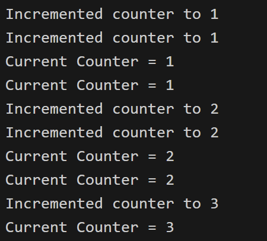
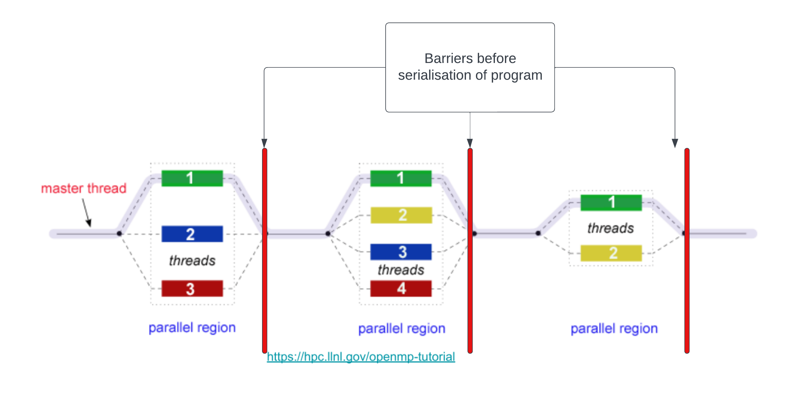
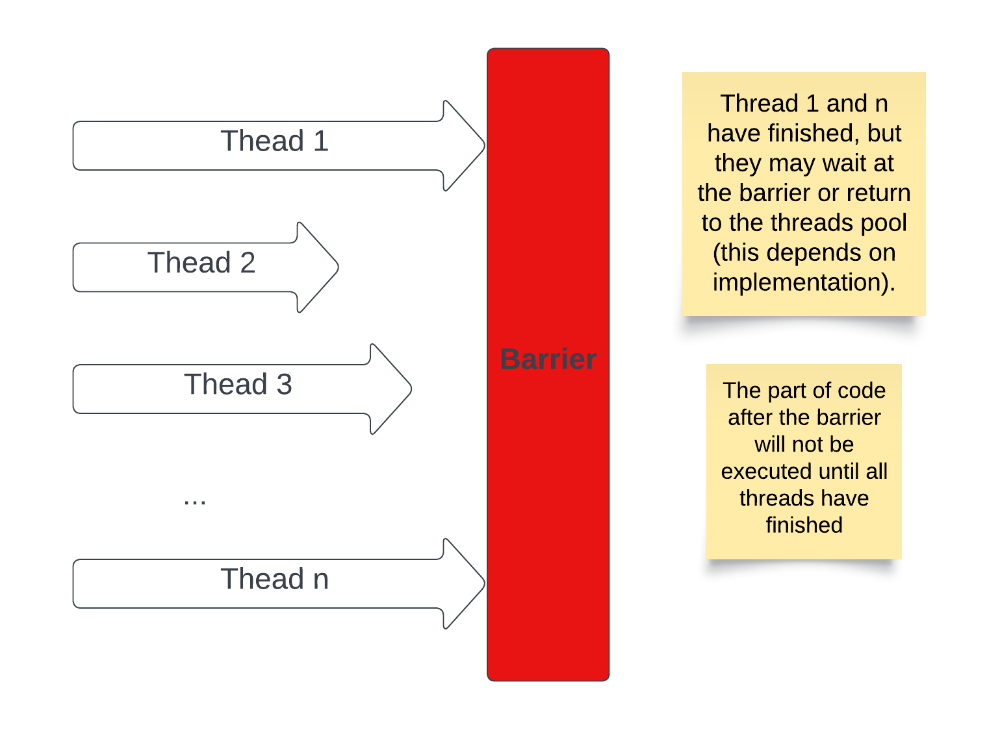
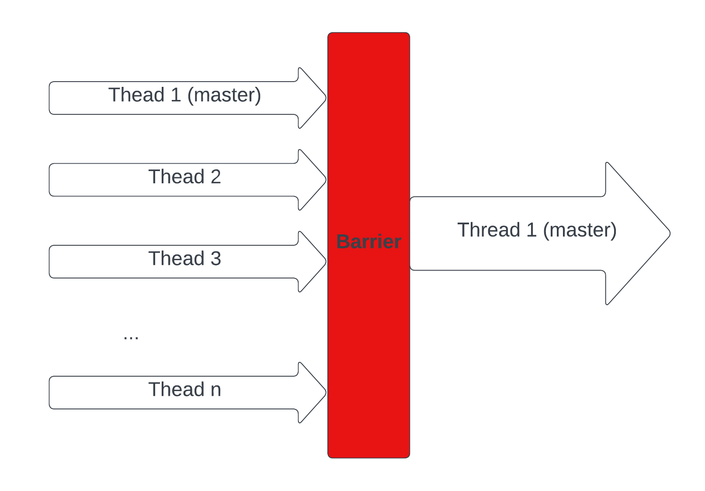
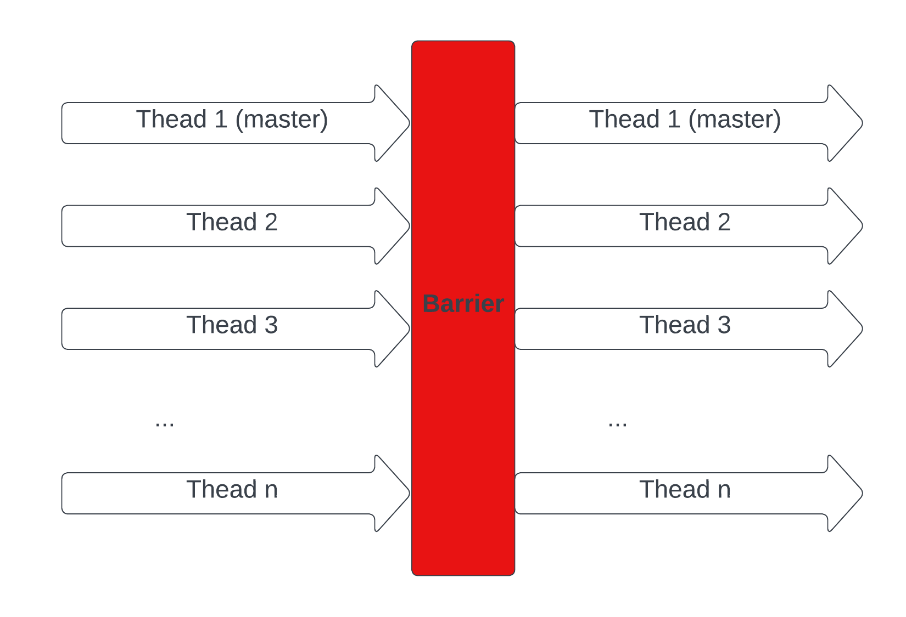

# Synchronisation

Synchronisation is the task of coordinating multiple processes (or threads) to join up or handshake at a certain point, in order to reach an agreement or commit to a certain sequence of action. This is important so that the different threads/processes you spawn in the parallel region don't contradict each other and corrupt your code. 

## Race Condition
A race condition is one of the most popular forms of this synchronisation corruption. It's essentially when your threads are in a "race" against each other to access a particular resource (eg. an int variable's value) and the loser's access/update to that resource is lost. 

> Instead of your threads fighting each other, you want them to work together perfectly synchronised i.e. more like an F1 pitstop crew than a toxic office place.

Let's start with this simple program:

```c
/*
We purposefully added the following code within the program:
- The sleep() calls allow thread switching in the middle of function calls.
- The silly variable assignments in increment() mimic the register.
- All functions are sharing a global counter variable.

Note that:
- Even if we remove all of the sleep() and the variable assignments,
the error can still occur by chance.

What should be the desired output?
What is the actual output?
*/
#include <omp.h>
#include <stdio.h>
#include <unistd.h>

float sleep_time = 0.1;
int counter = 0;                                    // Sharing across the program

int get_value() {
    sleep(sleep_time);                              // This will cause thread switching
    printf("Current Counter = %d\n", counter);
    return counter;
}

void increment() {
    int temp = counter;                             // Load counter to register
    sleep(sleep_time);                              // This will cause thread switching
    temp++;                                         // Increment the register
    counter = temp;                                 // Store back to the variable

    printf("Incremented counter to %d\n", counter);
}

int main() {
#pragma omp parallel for
    for (int i = 0; i < 5; i++) {
        increment();
        get_value();
    }
    
    return 0;
}
```

### Single Thread

Running the program using 1 thread:
```bash
export OMP_NUM_THREADS=1
./counter
```
The output should look something like this:


The program works great. No corruption at all.
- This is because we only used 1 single thread.
- The program is just a serial program without any parallelism.
- `sleep()` calls simply put the thread to sleep, that same thread will go to sleep, wake up, and continue the execution.

### Multiple Threads

```bash
export OMP_NUM_THREADS=2
./counter
```

Running the program using 2 threads may give us this output:

> Note: This is just one possible output.



What is happening here?
- We are using 2 threads.
- Both threads are trying to access the global variable `counter` at the same time (roughly).
- During the time when 1 thread is sleeping, the other thread may increment the shared counter.
- The 2 threads simply go on their way and not coordinate with each other.

> This is what a **Race Condition** is. A race condition occurs when two or more threads can access **shared data** and they try to **change it at the same time**.

### How to prevent race conditions in OpenMP?

There are a few approaches we can take:

* **Critical construct**: This restricts the code so that only one thread can do something at a time (in our example, only 1 thread can increment the counter at a time). It's used to specify a **critical region** which is another term for serial execution.

```c
int main() {
#pragma omp parallel for
    for (int i = 0; i < 5; i++) {
#pragma omp critical                                // Critical construct
        increment();
        get_value();
    }
    return 0;
}
```

This is unfortunatley not appropriate for some situations since it is bad for performance and destroys a lot of the speed-up we're trying to acheive in the first place.

* **Atomic construct**: This is quite similar to the critical construct, however it only applies to memory read/write operations. It has a better performance than the critical construct by taking advantage of the hardware. There's no lock/unlock needed on entering/exiting the line of code, it just does the atomic operation which the hardware tells you can't be interfered with. Let's look at another example:

> Run this program multiple times using multiple threads (before uncommenting the construct). Again, race condition!

```c
#include <omp.h>
#include <stdio.h>

int total = 0;
int n = 100;
int nums[100];

int main() {
    // Populate nums
    for (int i = 0; i < n; i++) {
        nums[i] = i;
    }

#pragma omp parallel for
    for (int i = 0; i < n; i++) {
        int temp = nums[i];
        /*
        We can easily resolve the race condition with atomic/critical construct.
        The atomic one will work perfectly and give better performance this time.
        Uncomment the construct below to resolve the race condition.
        */
// #pragma omp atomic
        total += temp;
    }
    printf("%d\n", total);
}
```

* **Reduction**: Based on the problem, sometimes, the best solution will be to use `reduction`. Let's analyse what this code is doing:

> Using `reduction` here results in significantly better performance.
> - A quick way to do some simple benchmarking is: `time a-command`
> - Conduct benchmarking for 3 versions, and trying in different number of threads

Example:
```bash
# Tuning the number of threads
export OMP_NUM_THREADS=4

# Change according to your file's name
time ./critical
time ./atomic
time ./reduction
```

```c
#include <omp.h>
#include <stdio.h>

int total = 0;
int n = 100;
int nums[100];

int main() {
    // Populate nums
    for (int i = 0; i < n; i++) {
        nums[i] = i;
    }

#pragma omp parallel for reduction(+:total) num_threads(3)
    for (int i = 0; i < n; i++) {
        int temp = nums[i];
        total += temp;
    }
    printf("Final total is: %d\n", total);
}
```

> Notice that:
> - The previous two approaches only allow 1 thread at a time to perform some operations.
> - Reduction allows threads to access the same shared data at the same time, but in different parts of the data.
>
> The nature of the word **synchronisation** in these two examples is completely different from each other, while still adhering to our initial definition!

## Barrier Synchronisation

In the last sub-chapter, we have talked about the [Fork - Join Model](./multithreading.md#fork-join-parallel-execution-model). We know that **"Once the team of threads complete the parallel region, they `synchronise` and return to the pool, leaving only the master thread that executes serially."**. However, there are a few important aspects that we have left out:
- The time taken to finish the assigned task is **different** for each thread.
- How can OpenMP know/identify **when** a thread has completed its own task.
- How can OpenMP know/identify **when** all threads have finished all the tasks.

The answer lies in something called **Barrier Synchronisation**. Here are illustrations for the idea:







### Implicit Barriers

The barrier synchronisation implicitly (behind the scenes) occur at the end of constructs (regions of code) such as parallel constructs ("`#pragma omp parallel`") and the end of worksharing constructs(loop, sections, single, and workshare constructs).

```c
#include <stdio.h>
#include <omp.h>

int main(void)
{    
    #pragma omp parallel {
        // Parallel code
        printf("Thread %d is executing...\n", omp_get_thread_num());
    }

    // Sequential code after the barrier
    printf("Main thread\n");
    return 0;
}
```

### Barrier Construct

The barrier construct specifies an **explicit** (We add the construct into the code by ourselves) barrier at the point at which the construct appears. The barrier construct is a stand-alone directive. Here is an illustration of the following code.



```c
#include <stdio.h>
#include <omp.h>

int main(void)
{    
    #pragma omp parallel
    {
        printf("Thread %d executes part 1\n", omp_get_thread_num());
        #pragma omp barrier

        // No thread will execute part 2 before part 1
        printf("Thread %d executes part 2\n", omp_get_thread_num());
    }
    return 0;
}
```

### Let's think about a way to implement a barrier

We don't need to know exactly how OpenMP implemented this feature, at least not right now (if you are interested in OpenMP implementation, [here](https://www.openmp.org/spec-html/5.0/openmpse25.html) could be a start). We can follow a rough simple approach:

- Let's assume we have `n` threads.
- We need a way to count how many threads that have finished, this can easily be done with a shared counter variable (be careful with race condition) among threads. When this counter reaches the number `n`, we will know that all threads have finished.
- We also need a mechanism to make a finished thread idle and **wait()** for other threads to finish.
- The last thread to finish has the responsibility of **notify()** other threads (threads that you want to be executed after the barrier).

Voila! we have a barrier.