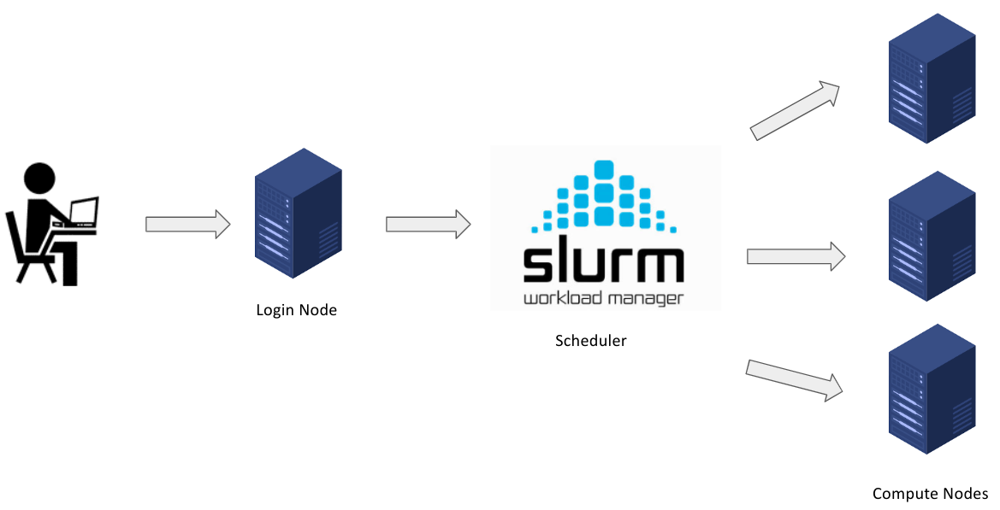
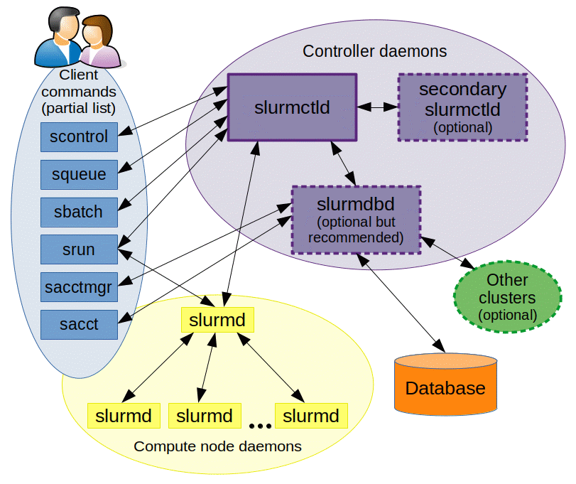

# SLURM

Slurm (Simple Linux Utility for Resource Management) is an open-source workload manager/scheduler for the M3 MASSIVE cluster. It was created back in the mid-2000s by SchedMd and now it's used by approximately 65% of the world's supercomputers. Slurm is basically the intermediary between the Login node and compute nodes. Hence, the Slurm scheduler is the gateway for the users on the login node to submit work/jobs to the compute nodes for processing.

Slurm has three key functions. 
1. It provides exclusive and/or non-exclusive access to the resources on the compute nodes to the users for a certain amount of time. Hence, the users can perform any computation with the resources. 
2. It provides a framework to start, execute, and check the work on the set of allocated compute nodes. 
3. It manages the queue of pending jobs based on the availability of resources.

The below diagram shows how Slurm works in the context of M3 MASSIVE.



## Slurm Architecture
Slurm has a centralized manager, slurmctld, to monitor resources and work. Each compute server (node) has a slurmd daemon, which can be compared to a remote shell: it waits for work, executes that work, returns status, and waits for more work. There is an optional slurmdbd (Slurm DataBase Daemon) which can be used to record job accounting information in a database.



## Basic Slurm Commands
Slurm provides a variety of tools for users to submit and manage jobs along with viewing info about them. These commands can be used interactively (on a terminal) in the login node.

| Commands | Syntax | Description |
| --- | --- | --- |
| `sinfo` | `sinfo` | Get information about the resources on available nodes that make up the HPC cluster. |
| `sbatch` | `sbatch <job-id>` | Submit a batch script to Slurm for processing. |
| `srun` | `srun <resource-parameters>` | Run jobs interactively on the cluster. |
| `skill/scancel` | `scancel <job-id>` | End or cancel a queued job. |
| `squeue` | `squeue -u` | Show information about your job(s) in the queue. The command when run without the -u flag, shows a list of your job(s) and all other jobs in the queue. |
| `sacct` | `sacct` | Show information about current and previous jobs.  |

## Slurm Job Scripting
Slurm job scripts are very similar to bash scripts but you will have to use a set of Slurm-specific directives (flags beginnig #) and Slurm-specific & Bash commands. 

In creating a Slurm script, there are **4 main parts** that are mandatory in order for your job to be successfully processed.

1. **Shebang:** The Shebang command tells the shell (which interprets the UNIX commands) to interpret and run the Slurm script using the bash (Bourne-again shell) shell.

> This line should always be added at the very top of your SBATCH/Slurm script. (Same as all Bash scripts)

2. **Resource Request:** In this section, the amount of resources required for the job to run on the compute nodes are specified. This informs Slurm about the name of the job, output filename, amount of RAM, Nos. of CPUs, nodes, tasks, time, and other parameters to be used for processing the job.

> These SBATCH commands are also know as SBATCH directives and must be preceded with a pound sign and should be in an uppercase format as shown below.

```
#SBATCH --job-name=TestJob
#SBATCH --output=TestJob.out
#SBATCH --time=1-00:10:00
#SBATCH --ntasks=1
#SBATCH --cpus-per-task=1
#SBATCH --mem-per-cpu=500M
```

3. **Dependencies:** Load all the software that the project depends on to execute. For example, if you are working on a python project, you’d definitely require the python software or module to interpret and run your code. Go to Chapter 5.6 for more info on this.

```
module load python
```

4. **Job Steps** Specify the list of tasks to be carried out.

```
srun echo "Start process"
srun hostname
srun sleep 30
srun echo "End process"
```

### Putting it all together
Please note that the lines with the double pound signs (##) are comments when used in batch scripts.

```
## Shebang
#!/bin/bash

## Resource Request
#SBATCH --job-name=TestJob
#SBATCH --output=TestJob.out
#SBATCH --time=1-00:10:00
#SBATCH --ntasks=1
#SBATCH --cpus-per-task=1
#SBATCH --mem-per-cpu=500M

## Job Steps
srun echo "`Start process`"
srun hostname
srun sleep 30
srun echo "`End process`"
```

In the script above, 1 Node with 1 CPU, 500MB of memory per CPU, 10 minutes of Walltime was requested for the tasks (Job steps). Note that all the job steps that begin with the srun command will execute sequentially as one task by one CPU only.

The first job step will run the Linux echo command and output Start process. The next job step(2) will echo the Hostname of the compute node that executed the job. Then, the next job step will execute the Linux sleep command for 30 seconds. The final job step will just echo out End process. Note that these job steps executed sequentially and not in parallel.

It’s important to set a limit on the total run time of the job allocation, this helps the Slurm manager to handle prioritization and queuing efficiently. The above example is a very simple script which takes less than a second. Hence, it’s important to specify the run time limit so that Slurm doesn’t see the job as one that requires a lot of time to execute.