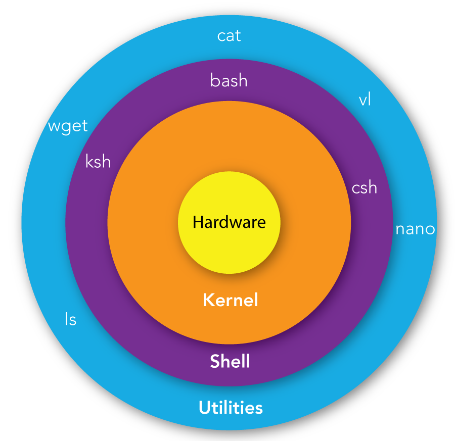

# Bash Commands & Scripts

Bash (the Bourne-Again SHell) is a terminal that allows you to enter commands and write scripts in order to access the Kernel's functionality. It's similar to system libraries (for programming) and the GUI (for non-IT people) in that it's a way to navigate your operating system and use the services that it provides, i.e. it's your kernel's interface. Bash in particular was created in the late 1980s as part of the GNU project and it was intended to replace the Bourne shell, hence Bourne-again shell.




## Basic Linux Commands

These commands will be your bread and better whenever you can't access the GUI or the GUI doesn't provide enough functionality, which will be the case for a lot of HPC work. You will have to be comfortable using these commands, writing Bash scripts and navigating the Linux environment.

| Command | Function |
| --- | --- |
| `pwd` | prints current directory |
| `ls` | prints list of files / directories in current directory (add a `-a` to list everything, including hidden files/directories |
| `mkdir` | makes a directory |
| `rm <filename>` | deletes *filename*. add `-r` to delete directory. add `-f` to force deletion (be really careful with that one) |
| `cd <directory>` | move directory.  |
| `vim` or `nano` | bring up a text editor |
| `cat <filename>` | prints contents of file to terminal |
| `echo` | prints whatever you put after it |
| `chmod <filename>` | changes permissions of file |
| `cp` | copy a file or directory|
| `mv <filename>` | move or rename file or directory |
| `grep` | Search for a pattern in files |
| `touch <filename>` | Create an empty file in current dir |

> Note: `.` and `..` are special directories. `.` is the current directory, and `..` is the parent directory. These can be used when using any command that takes a directory as an argument. Similar to these, `~` is the home directory, and `/` is the root directory. For example, if you wanted to copy something from the parent directory to the home directory, you could do `cp ../<filename> ~/`, without having to navigate anywhere.

### Piping

If you want to use the output of one command as input to another, you can simply "pipe" it to the other command. For example, if you want to search your directory to find a file named `somefile.someextension` you can do this:

```bash
ls | grep somefile.someextension
```

## Bash Scripts

Bash is both a command line interface and a scripting language. Bash scripts are useful for automating tasks that you do often, or for running a series of commands that you don't want to type out every time.

In terms of use, Bash can encapsulate any command you would normally run in the terminal into a script that can be easily reused. For example you could have a script that automatically navigates to a directory and activates a virtual environment, or a script that compiles and runs a C program.

The basic syntax of a bash file is as follows:

```bash
#!/bin/bash

# This is a comment

echo "Hello World"
```

We can save this file as `hello.sh` and run it using the following command: `source hello.sh`. This will print `Hello World` to the terminal.

Let's walk through the file. The first line is `#!/bin/bash`. This is called a shebang, and it tells the system that this file is a bash script. The second line is a comment, and is ignored by the system. The third line is the actual command that we want to run. In this case, we are using the `echo` command to print `Hello World` to the terminal.

Bash can do a lot more, including basic arithmetic, if statements, loops, and functions. If you want to learn more about bash, you can find a good tutorial [here](https://linuxconfig.org/bash-scripting-tutorial).

The main things we need to be able to do are to run executables and files. We do this the exact same way as if manually running them in the terminal. For example, if we want to run a python script, we can do the following:

```bash
#!/bin/bash

# This will run hello.py using the python3 executable
python3 hello.py
```

If we want to compile and then run a C program, we can do the following:

```bash
#!/bin/bash

# This will compile hello.c and then run it
gcc hello.c -o hello
./hello
```
