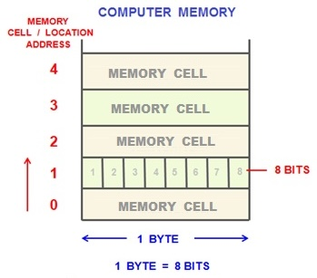
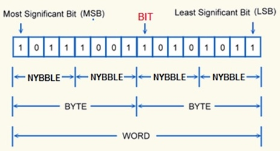
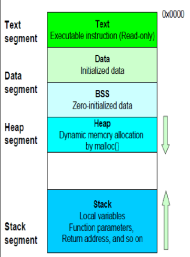

# Pointers & Memory

Memory is one of the most important concepts in all of computing. Memory is the primary resource utilised in all programs and when it comes to large scale applications and programs it can easily be depleted. Being able to fine tune and control memory usage is one the best ways to optimize programs to ensure they are efficient and fast. However, this has the downside the programmer must control exactly how memory is used at all times increasing the cognitive complexity of a program which increases the likelihood that memory is misused programs leaking the resource. Many languages hide the details of memory usage and control to help reduce this cognitive complexity and reduce the risks of manual memory management. This can be done a variety of ways, from interpreters and virtual machines (Python, Java and C#) to using abstractions and semantics to hide the details while still allowing control when needed (C++, Rust) to straight up using a completely unique memory and data models (Haskell) however, C's memory model is the closest to how memory is truly laid out in hardware, largely because C and computer architecture have evolved together for so many decades. This is also because C is compiled end-to-end meaning source code is compiled directly into the machine language of the target machine not an intermediate bytecode or otherwise. This means that it is far simpler for C to model a machines memory architecture than create its own. This also simplifies C concept of memory greatly giving programmers the greatest level of control of memory (and other compute resources).

## Brief Introduction into Memory

So what is memory? Memory; in its most abstract notion, is an 'infinite' sequence of fixed size cells. The size of these cells is (generally) 8-bits or a byte. On almost every computer, bytes are the smallest addressable unit of memory ie. they are the atoms of data. Any data you can build with a computer ultimately becomes some combination of bytes. But wait, what is a bit? A bit is a _binary digit_, thing of a regular (decimal) digit. It has 10 possible states (0..9) until it overflows and you need another digit (9 -> 10). A bit has only two possible states, 0 and 1. 



Bits are used as the extremely effective at modelling logical circuits where a wire is either on or off. Bits form the foundation for all of computing. However, inspecting and manipulating individual bits is tedious and only useful for small scale interactions. The goal of computing is to increase the computational power and thus reduce the time it takes to perform certain operations. This is why memory uses bytes. They are far easier to manipulate and are able to represent far larger data sets than a single bit (\\(2^{8}=256\\) combinations to be exact). However, while we can address individual bytes in memory this can be quite limiting in the number possible _memory locations_ a CPU can address if we used a byte to represent the numerical address location of memory (a byte). Instead many machines use a machine _word_ which represents the size of data a CPU is able to understand/read. The size of a word will correspond to the size of a CPU's registers, memory and IO buses and arithmetic manipulation hardware. Most machines have a word size of 64-bits or 8 bytes which dramatically increases the size of the instruction set used by a CPU, the amount of data it can transfer on buses and the amount of memory a CPU is able to address (\\(2^{8}=256\\) vs. \\(2^{64}=1.844674407371 × 10^{19}\\)). This is the largest integral value a machine is able to handle for most operations (ignoring specialised hardware).



### The Stack & Heap

Now, most computers do not give away all of their memory to a single application nor will memory used by an application allocate memory all from the same place. When a program executes the OS will allocates a small amount of memory to the memory for the instructions, constant data, meta data about the program and a small amount of free memory. This small amount of free memory is called the stack. Any local variables, function call stack and data created in a program are allocated to this part of the program automatically. However, the stack is quite small so when you need access to a large amount of memory you have to request it from the OS explicitly. The location where this OS owned memory is kept is called the heap (or free store). The heap is theoretically infinite in size allowing you to store large amounts of data however, you must remember to return it to the OS when you are done otherwise the memory will leak and the OS will loose track of it when your program finishes (or crashes).



Besides, the stack and the heap you have the text and the data segment. The text segment would contain your executable instructions (your compiled C code) while the data segment has all initialised data. You also have a few other segments like BSS (Block Started by Symbol) which contains all uninitialised data and others not mentioned in the diagram above such as OS-reserved sections for Kernel code and data. If you ever wondered what RAM (main memory) actually looks like, well now you know.

## What are Pointers?

So how do we refer to a memory. Fundamentally we need to be able to store the address of some piece data. This address is just some unsigned integer; with a bit size equivalent to a machine word. Using this address we then need to be able redirect access to the data held by at this memory address. We could just use a special integer type that corresponds to a machine word type and use this to store an address however, we often want to be able to access other pieces of data surround the data at the address we are storing thus we need to also be able to encode the type or size of the data whose address we are holding. This is because, while addresses all have the same size/width, it may own some data that is larger or smaller. Remember the smallest addressable machine location is a byte not a machine word. This construction we have described is called a pointer, simply because holds the location of some data ie. it points to some data. The type of a pointer is the type of the data being **_pointed to_** followed by an asterisks.

```c
bool* pb;       //< Pointer to a bool
int* pi;        //< Pointer to an int
float* pf;      //< Pointer to a float
double* pd;     //< Pointer to a double
void* pd;       //< Pointer to a void
```

> **Note:**
>
> - `void*` represents a **polymorphic** pointer type meaning it can point to data of any type and must be cast to the correct type on usage.


<!-- > - Usage in  function signatures -->

### Obtaining Pointers

Every variable has an address regardless of whether they are created on the stack or the heap. So how do we get the address of a variable? There is a special operator we use called 'addressof' that returns the address of any variable. Its syntax is an ampersand (`&`) prefixed to any variable name.

```c
#include <stdio.h>

int main()
{
    int a = 4;
    double b = 5.687;

    int* ap = &a;  //< can be assigned to a variable...

    printf("%d is at address: %p", a, ap);
    printf("%f is at address: %p", b, &b);  //< or used as a temporary

    return 0;
}
```

### `NULL`

Sometimes a pointer does not own or point to anything. Instead of it pointing to data that might potentially not be ours to access we instead set the pointer to point to a compiler defined location called `NULL`. This is the empty address which prevents invalid access to it, usually by crashing though rather than undefined behaviour occurring. Always initialise or set a pointer to `NULL` if it does point to something and always check; when reasonable, if a pointer is `NULL`  to prevent invalid access operations.

```c
#include <stdio.h>

int main()
{
    int* p = NULL;
    printf("p points to: %p\n", p);

    int a = 4;
    p = &a;

    printf("p points to: %p\n", p);

    return 0;
}
```

### Pointer Operations

Because pointers are just integral values we can perform regular integer arithmetic on them such as increment or decrement the address value to point to the next or previous memory location. You can also take the difference of two pointers to find the distance of two memory locations, add or take integral values from a pointer to jump a certain number of steps forward or backwards. The post important operation you can perform on a pointer is dereference it. This gives you access to the data being pointed to. Dereference involves using a prefix asterisks on the pointer variable. Any operation that is valid on the underlying data is valid on a dereference pointer.

```c
#include <stdio.h>

int main()
{
    int a = 4;
    int* p = &a;

    printf("p points to: %p, with a value %d\n", p, *p);

    return 0;
}
```

### Pointers to Pointers

Because pointers are just a numerical value they also have to store that numerical value. This value also has an address thus you are able to take the address of the pointer itself to obtain a pointer to a pointer. The type of a pointer to a pointer is the regular pointer type with additional asterisks suffixed to the type. This also means you can dereference the pointer to a pointer to obtainer the original pointers stored value which is the address of the original data. You can then dereference this pointer to get to the actual value. Additional dereferencing can be achieved by prefixing more asterisks to the pointer variable. This can be done for any number of pointer dereferences (pointer indirections).

```c
#include <stdio.h>

int main()
{
    int a = 4;
    int* p = &a;
    int** pp = &p;

    printf("pp points to: %p, with a value %p\n", pp, *pp);
    printf("p points to: %p, with a value %d\n", p, *p);

    return 0;
}
```

### Strings & Arrays as Pointers

Earlier, we kind of lied to you. We said that C supports array types. This is not entirely true. In reality arrays are just a pointer to a contiguous block of memory. In particular, the pointer points to the first memory location (element) of the array. The one difference is that arrays support the use of the subscript operator `[]` which performs a jump of `n` elements from the first element and automatic dereference of the pointer value giving you efficient access to the desired element. And because strings are just character arrays they are really just a pointer to the first element in the string literal ie. a `char*`. Almost always an array will decay into a pointer to the first element, particular when passing it to a function.

> Note: Pointers still technically support `[]` but unless it points to a contiguous block of data, the operation is mostly useless.

```c
#include <stdio.h>

int main()
{
    char greeting[] = "Hello";
    char* farewell = "Goodbye";

    puts(greeting);
    puts(farewell);

    return 0;
}
```

<!-- ## Function Pointers

~ -->
