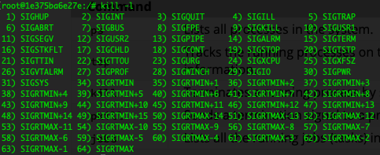

# Processes & Threads
As introduced earlier, when computer runs a program, your source code is loaded into RAM and process is started.
A **process** is a collection of code, memory, data and other resources.
A process runs in a unique address space. So Two processes can not see each other’s memory. 

A **thread** is a sequence of code that is executed inside the scope of the **process**. You can (usually) have multiple **threads** executing concurrently within the same process. 
**Threads**  can view the memory (i.e. variables) of other threads within the same process


A **multiprocessing** system has more than two processors, whereas **multithreading** is a program execution technique that allows a single process to have multiple code segments. 

## Bash Process Management
There are several commands in Bash for process management. Following are some commonly used commands:

| Command  | Purpose                                                  |
|----------|----------------------------------------------------------|
| `ps`       | Lists all processes in the system.                       |
| `top`      | Tracks the running processes on the system and provides real-time information. |
| `kill`     | Terminates a running process by sending a signal.        |
| `pkill`    | Sends a termination signal to a process.                 |
| `jobs`     | Lists all the running jobs (tasks) in the system.        |
| `fg`       | Moves a background process to the foreground.            |
| `bg`       | Restarts a stopped process to run in the background.     |
| `nice`     | Adjusts the priority of a process.                       |
| `renice`   | Changes or adjusts the priority of a running process.    |
| `free`     | Displays the status of RAM.                              |
| `df`       | Shows the disk management of the system.                 |

As you might have noticed if you ran `ps` or `top`, each Bash command spawns (creates) a process. That's because all of these commands are just executable binary files that are software programs (exactly the same as compiled C code) that you can find in one of your system directories.

### Signals
In Linux, a signal is a notification sent to a process to indicate an event. Typically it is triggered by the operating system, hardware, or other processes in order to signify various events, including process termination, user interrupts, errors, and system events. A unique identifier represents each signal and has predefined behaviors associated with it.

To get a list of all signals in Bash use:
```bash
kill -l
```

Which should give you an output similar to below,



From the above you can see that to kill/terminate a process (SIGKILL), you need to use signal 9. To kill a process you can use the command `kill -9 <pid>`. If you need to kill a deadlocked/non-responsive process on a HPC node with no GUI, this would come in handy.

## Process Priorities
A process's priority determines when and how much CPU walltime it gets. This is also the case in Slurm or any other multi-user/multi-process system with a scheduler so it's useful to know how process priorities work. 

Managing a process’s priority involves altering the order of priority in which processes are executed by the system. By setting the priority, you can make sure that the most important tasks get the most CPU time to receive the necessary system resources compared to the less important tasks. Some common aspects of prioritizing processes:

### Process Priority Range

The priority value of a process is known as the ‘nice value’ that typically ranges from -20 to 19, where -20 indicates the highest priority and 19 indicates the lowest priority. By default, the processes launched from the terminal have a zero (0) value of priority. The negative values (-20 to 0) are reserved for real-time tasks while the positive values (0-19) are for normal user processes or tasks.

### Using “nice” Command

The nice command starts a process with a specified priority level. It assigns a lower priority to a process as the lower the nice values, the higher the priority. The syntax to use the nice command is `nice -n <priority> <command>`.

### Using “renice” Command

The renice command modifies and adjusts the priority of a process that is already running. This command either increases or decreases the priority of a process based on the specific value. The syntax to use the renice command is `renice <priority> -p <pid>`.

> Decreasing priority can be done by any user in the system but the priority can only be increased by the process owner or the super user (root).

## Threading & Concurrency

