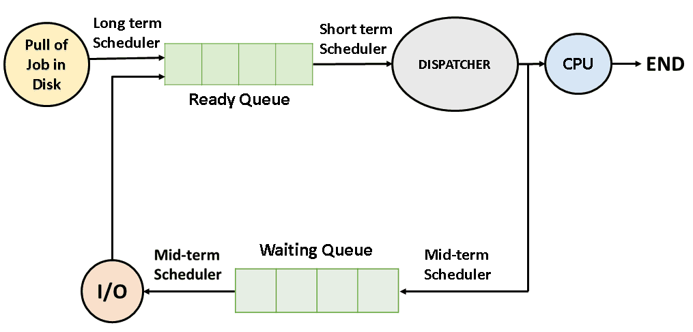
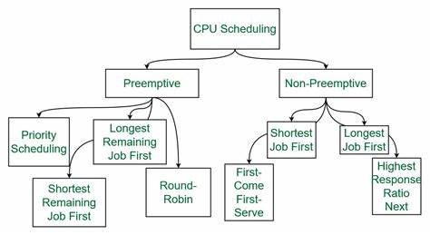
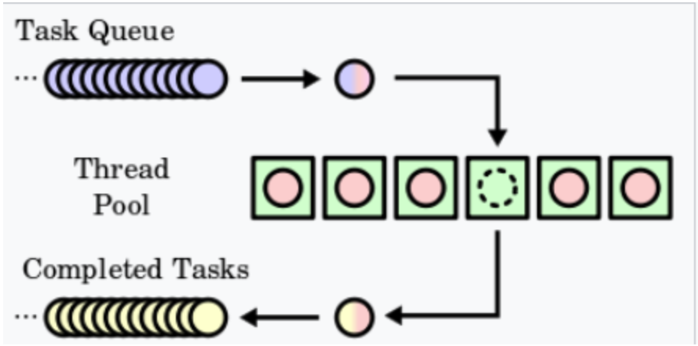
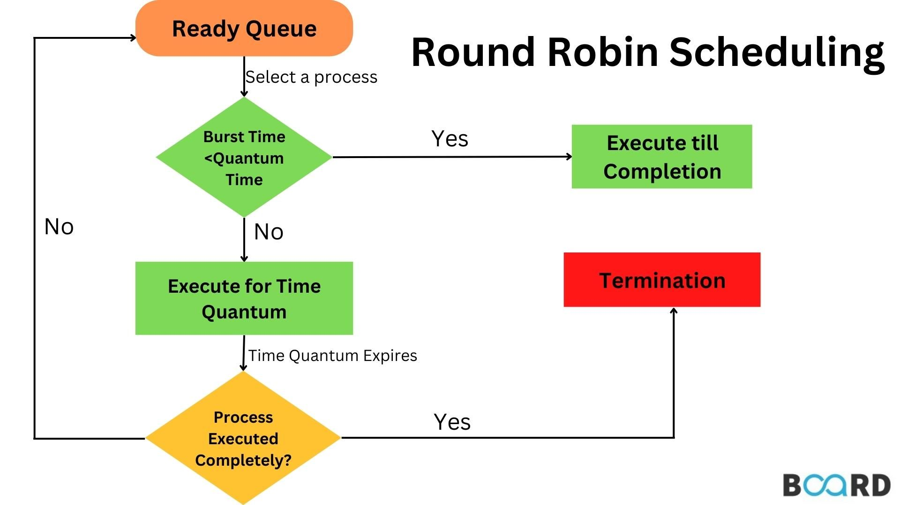
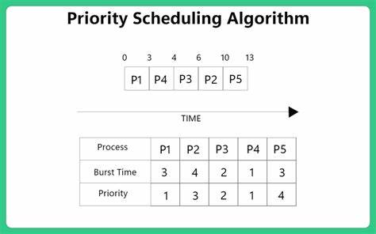

# Scheduling Algorithms

As you might've noticed, your computer **runs a large amount of processes** (around 500+) at any given time. Most of them are system utilities and kernel processes that you don't really have access to but a lot of them involve applications you opened or commands you've typed into your terminal. Even though most modern CPUs have 8+ cores so they can run 8 processes/execute 8 threads at the same time, there's obviously a need to **queue these processes** and schedule them time on the CPU in an orderly manner. In order to do this, there are a variety of scheduling algorithms.

Knowing these scheduling algorithms also helps you understand how scheduling works in a HPC cluster. This is important if you're involved in a HPC project that builds, manages and/or analyses a cluster from an admin perspective and also as a user that's wondering why their job (process) isn't getting much time on compute nodes.

Hopefully the diagram above is self-explanatory at this point. There's a lot of implementation details involved in the specific type of scheduler you're using (i.e. Linux Kernel) but we will focus on high-level concepts that are also generalisable to HPC cluster schedulers.

## Terminology
Before we start there's some terminology to clarify and define:
- **Preemptive Scheduling:** This is a scheduling policy where a process running in a CPU can be interrupted (blocked/stopped) and moved to the ready state while another process starts running on the CPU.
- **Wait Time:** Wait time refers to the period during which a process remains in the ready queue, waiting for CPU execution.
- **Arrival Time:** Arrival time is the moment when a process enters the ready state and becomes eligible for execution.
- **Burst Time:** Burst time (execution/wall time) is the total time taken by a process to execute on the CPU.
- **Turnaround Time:** Turnaround time is the total time taken for a process to complete its execution from submission to exit. It includes the waiting time, execution time, and any other overhead (such as context switching). Turnaround time is a crucial metric for evaluating scheduling algorithms and system performance (for both PCs & HPC cluster).

## First Come First Serve (FCFS)
This is the simplest CPU scheduling algorithm that schedules according to arrival times of processes. The first come first serve scheduling algorithm states that the process that requests the CPU first is allocated the CPU first. It is implemented by using a FIFO (first-in, first-out) queue. When a process enters the ready queue, its PCB (process control block) is linked to the tail of the queue. When the CPU is free, it is allocated to the process at the head of the queue. The running process is then removed from the queue.

<ins> Characteristics of FCFS: </ins>
- FCFS supports non-preemptive and preemptive CPU scheduling algorithms.
- Tasks are always executed on a First-come, First-serve concept.
- FCFS is easy to implement and use.
- This algorithm is not very efficient in performance, and the wait time is quite high.

## Round Robin Scheduling

Round-robin scheduling allocates each task an equal share of the CPU time. In its simplest form, tasks are in a circular queue and when a task's allocated CPU time expires, the task is put to the end of the queue and the new task is taken from the front of the queue.

**Advantages:**

- It is not affected by the convoy effect or the starvation problem as occurred in First Come First Serve CPU Scheduling Algorithm.

**Disadvantages:**

- Low Operating System slicing times will result in decreased CPU output.
- Round Robin CPU Scheduling approach takes longer to swap contexts.
- Time quantum has a significant impact on its performance.
- The procedures cannot have priorities established.

## Shortest Job First Algorithm

In the Shortest Job First (SJF) algorithm, processes are scheduled based on their burst time rather than their arrival time. This algorithm aims to minimize waiting time and maximize throughput. However, a challenge with SJF is that CPU burst times are often not known in advance. To address this, various techniques can be used to estimate burst times, such as analyzing process size or type.

## Priority Scheduling

In priority scheduling, each process is assigned a priority number. Depending on the system, a lower or higher priority number indicates higher priority. There are two types of priority scheduling: preemptive and non-preemptive.

### Non-Preemptive Priority Scheduling

In non-preemptive priority scheduling, processes are scheduled based on their priority number. Once a process is scheduled, it runs to completion without interruption. Typically, lower priority numbers indicate higher priority.

### Preemptive Priority Scheduling

In preemptive priority scheduling, when a process enters the ready queue, its priority is compared with those of other processes, including the one currently being executed. The process with the highest priority among all available processes is given the CPU. Unlike non-preemptive scheduling, a running process can be interrupted by a higher priority process.

### Example

Consider a scenario with 7 processes: P1, P2, P3, P4, P5, P6, and P7. Each process has a priority, arrival time, and burst time. Let's walk through an example to understand how priority scheduling works:

- At time 0, P1 arrives with a burst time of 1 unit and priority 2. Since no other process is available, P1 is scheduled immediately.
- At time 1, P2 arrives. Since P1 has completed execution, P2 is scheduled regardless of its priority.
- At time 2, P3 arrives with a higher priority than P2. Thus, P2's execution is halted, and P3 is scheduled.
- During the execution of P3, three more processes (P4, P5, and P6) become available. However, since their priorities are lower than that of P3, they cannot preempt P3's execution.
- After P3 completes execution, P5, with the highest priority among the remaining processes, is scheduled.
- Once all processes are available in the ready queue, the algorithm behaves as non-preemptive priority scheduling. The process with the highest priority (P4) is executed till completion without interruption.
