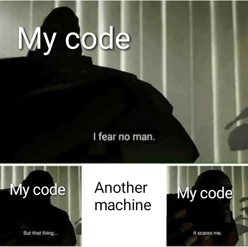

# VMs & Containers

In order to succeed in HPC, you will need to know how distributed computing works. Virtual machines and containers are a way of doing distributed computing and we'll give a decent introduction to them here. They help in a lot of scenarios both in your MDN work and in the real-world by allowing you to manage dependencies (eg. for a custom benchmarking script) and deploy an application into a server (eg. for a public HPC visualisation website).

## What is a virtual machine (VM)?

A virtual machine is not a physical machine. It’s a file that replicates the computing environment of a physical machine. It’s similar to how virtual reality (VR) environments replicate the real world. VR isn’t a physical space; it’s a virtual imitation. Still, we can perform real-world functions in VR, such as exploring and interacting with objects. Instead of imitating video game functions, virtual machine software emulates computer system functions i.e. the operating system. To achieve this VMs use a technology called **virtualisation** as shown below.


At the base, you have the host hardware and OS. This is the physical machine that is used to create the virtual machines. On top of this, you have the hypervisor. This allows multiple virtual machines, each with their own operating systems (OS), to run on a single physical server.

VMs have a few downsides, though, which containers address. Two downsides particularly stand out:

- **VMs consume more resources:** VMs have a higher resource overhead due to the need to run a full OS instance for each VM. This can lead to larger memory and storage consumption. This in turn can have a negative effect on performance and startup times of the virtual machine.
- **Less portability:** VMs are typically less portable due to differences in underlying OS environments. Moving VMs between different hypervisors or cloud providers can be more complex.


There are a few upsides though and they mostly apply if you need **better isolation/security** or **more control** over low level things that containers don't give you access to. If you want to learn how to launch and use VMs, it's covered in [ARDC's Nectar Cloud starter tutorial series](https://tutorials.rc.nectar.org.au/cloud-starter/01-overview). You can also check out other cloud platform providers like Amazon Web Services (AWS) and Microsoft Azure.

## What is a container?

A container is a lightweight, standalone, and executable software package that includes everything needed to run a piece of software, including the code, runtime, system tools, and libraries.

Containers are designed to isolate applications and their dependencies, ensuring that they can run consistently across different environments. Whether the application is running from your computer or in the cloud, the application behaviour remains the same.

Unlike VMs which virtualise the hardware, containers *virtualise the operating system*. This simply means that a container uses a single OS to create a virtual application and its libraries. Containers run on top of a shared OS provided by the host system.


The container engine allows you to spin up containers. It provides the tools and services necessary for building, running, and deploying containerised applications. If you ever had the problem below, containers are a life saver.



## Docker
As you might know, Docker is an open-source containerization platform by which you can pack your application and all its dependencies into a standardized unit called a container. Let's clarify some Docker terminology,

- **Docker Image**: An image is an inert, immutable, file that's essentially a snapshot of a container. Images are created with the [build](https://docs.docker.com/reference/cli/docker/image/build/) command, and they'll produce a container when started with [run](https://docs.docker.com/reference/cli/docker/container/run/). Images are stored in a Docker registry such as [registry.hub.docker.com](https://registry.hub.docker.com).
- **Docker Container**: To use a programming metaphor, if an image is a class, then a container is an instance of a class—a runtime object. Multiple containers can run from the same image simultaneously.
- **Docker Daemon**: The Docker daemon (`dockerd`) listens for Docker API requests and manages Docker objects such as images, containers, networks, and volumes.
- **Docker Client**: The Docker client (`docker`) is the primary way that many Docker users interact with Docker. When you use commands such as `docker run`, the client sends these commands to `dockerd`, which carries them out.
- **Docker Desktop**: This is an easy-to-install application for your Mac, Windows or Linux environment that enables you to build and share containerized applications and microservices.

### Docker Architecture
Docker uses a client-server architecture. The Docker client talks to the Docker daemon, which does the heavy lifting of building, running, and distributing your Docker containers.


Go through [this guide](https://www.docker.com/get-started/) to download and install Docker. If you'd like to learn more about it's functionality and how to work with it, [check out their documentation website](https://docs.docker.com/get-started/overview/). We will go through the basics of how Docker and it's CLI (command-line interface) works to get you started.

#### Launch Docker Daemon
Before we get started it's important to make sure the Docker daemon (background process that manages Docker) is running. In order to launch it, go to your docker desktop app and run it.

#### Check Version
If you want to know what version of Docker you're running, use this command. It's also a useful command for checking if you've correctly installed and launched Docker.
```
docker version
```

#### More Info
For more info about installation and the no. of Docker objects (images, containers, networks, etc...) use this command.
```
docker info
```

#### List Containers
To list all running containers use the command below. To include ones that are not currently running as well, use the command with the `-a` flag.
```
docker ps
```

#### List Images
Likewise to list all images you have downloaded, use the command below.
```
docker images
```

#### Download Image
Similar to GitHub, if you want to download an image you "pull" it from the Docker registry.
```
docker pull nginx
```
This command will pull the latest image of [nginx (a HTTP server)](https://nginx.org/en/) from [Docker Hub's registry](https://hub.docker.com/_/nginx).

#### Stop/Remove Containers & Images
To stop a running container and to remove containers and images you use the following commands.
For stopping a container:
```
docker stop {container_name_or_id}
```
For removing a container:
```
docker rm {container_name_or_id}
```
For removing an image:
```
docker rmi {image_name_or_id}
```

#### Start and work with containers
To create a new container from an image after you've pulled it, use:
```
docker run {image_name_or_id}
```
After the container is created, you can start (launch) it by running:
```
docker start {container_name_or_id}
```
If you want to actually run commands inside, for example - to open a Bash terminal:
```
docker exec -it {container_name_or_id} bash
```
> The `-it` flag specifies to run it in interactive mode `-i` and to allocate a psueo-TTY `-t`.

### Advanced Docker Concepts
This is a little out of scope for the training book but if you want to build your Docker image, you will have to use [docker build](https://docs.docker.com/build/). Other docker functionality to be aware of:

- For managing a lot of containers using declarative config files - [Docker Compose](https://docs.docker.com/compose/)
- To find and share container images (like GitHub) - [Docker Hub](https://docs.docker.com/docker-hub/)
- If you want your containers to talk to each other - [Docker Network](https://docs.docker.com/network/)
- For image scanning, analysis and security-related things - [Docker Scout](https://docs.docker.com/scout/)

There are a bunch of other extensions and software that's designed to work with Docker that are not mentioned here. Important takeaway here is that if you ever have to manage dependencies and/or work across teams doing that *(which you will definitely have to do in an advanced HPC project)* - containers make your life a lot easier. This is also the case if you want to deploy and scale any web service for which you can use something like [Kubernetes](https://kubernetes.io). Container-based deployments are becoming more and more popular due to how lightweight and flexible they are compared to traditional virtual machines.